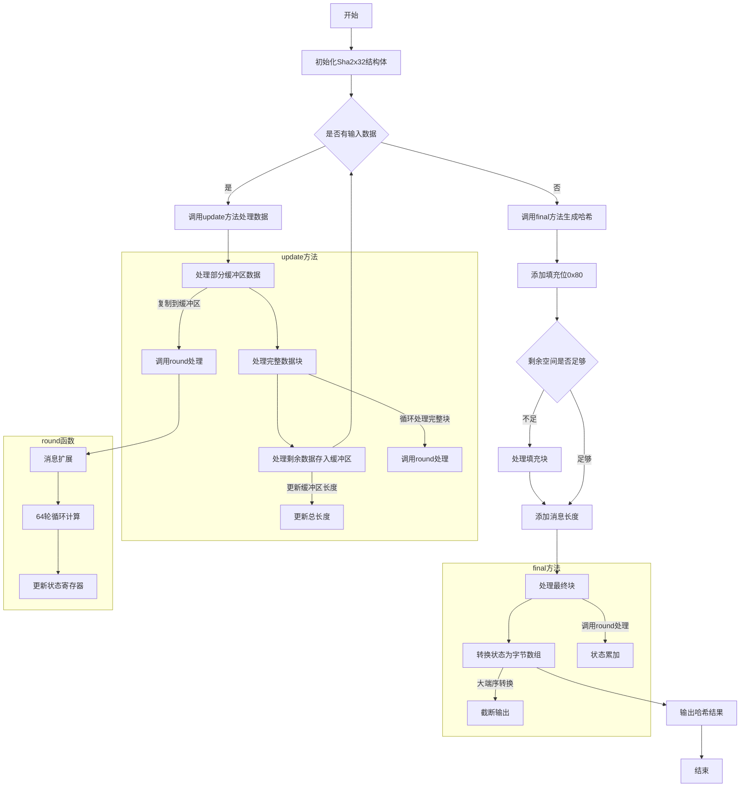

好的，我需要帮用户画出这个Zig函数的流程图，使用Mermaid语法。首先，我需要理解这个函数的结构和逻辑。

这个函数名为Sha2x32，看起来是实现了SHA-2哈希算法中的某个变种，比如SHA-256。函数返回一个结构体，包含了初始化、更新数据、最终处理等方法。我需要理清各个方法的调用流程，以及它们之间的交互。

首先看`init`方法，它初始化结构体的状态，设置初始向量。然后是`update`方法，处理输入的数据块，可能涉及到缓冲区的管理，以及调用`round`方法进行每一轮的计算。`final`方法处理最后的填充，生成最终的哈希值。`round`方法应该是核心的哈希计算部分，可能包含循环和位操作。

接下来，我需要将这些步骤分解成流程图中的各个节点。可能包括：

1. 初始化（init）
2. 更新数据（update）
   - 处理缓冲区
   - 处理完整的数据块
   - 处理剩余数据
3. 最终处理（final）
   - 填充数据
   - 处理最后一个块
   - 输出结果
4. round函数的详细步骤
   - 扩展消息块
   - 进行多轮计算
   - 更新状态

还需要考虑条件判断，比如在update中是否有部分缓冲区需要先处理，或者在final中是否需要额外的块来处理填充。此外，不同的硬件加速路径（如ARM和x86的优化）可能需要不同的处理分支，但可能在流程图中简化为一个步骤，除非用户特别强调这部分。

需要注意的是，Mermaid的流程图语法相对简单，可能无法表达所有细节，但可以突出主要步骤和逻辑流程。可能需要将复杂的函数分解为多个子流程，比如将update和final作为主流程中的步骤，而round作为子流程。

另外，用户提供的代码中有很多条件编译和硬件优化的部分，但在流程图中可能不需要详细展开这些，除非用户特别要求。因此，可以将其视为一个黑盒，重点放在主要的数据处理流程上。

最后，验证流程图是否覆盖了所有关键步骤，并且逻辑正确。例如，数据如何从输入经过update处理，最后通过final生成哈希值，以及各个方法之间的调用顺序。
================================================
