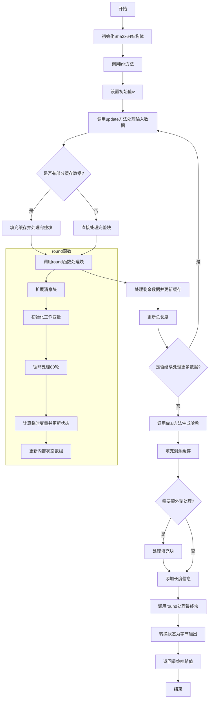

好的，我现在需要帮用户用Mermaid画出他们提供的Zig代码的流程图。首先，我需要仔细阅读并理解这段代码的功能和结构。

这段代码定义了一个名为Sha2x64的函数，返回一个结构体，看起来像是实现了SHA-2哈希算法的某个版本，可能是SHA-512或其变种。结构体包含初始化、更新数据、最终处理等方法。我需要理清每个方法的执行流程，尤其是update和final这两个核心方法。

首先，查看init函数，它初始化结构体的状态。update函数处理输入数据的分块，处理缓存和中间块。final函数处理最后的填充和生成最终的哈希值。round函数是处理每个数据块的核心，进行一系列的轮运算。

接下来，我需要确定流程图的层次结构。主流程可能从init开始，然后是update多次调用处理数据，最后调用final生成结果。每个方法内部的条件判断和循环需要被分解成步骤。

在update函数中，首先处理已有的部分缓存数据，然后处理完整的中间块，最后保存剩余数据到缓存。这涉及条件判断和循环，需要表现在流程图中。例如，判断buf_len是否非零且是否有足够数据填满块，处理完整块，处理剩余数据。

final函数处理填充，添加长度信息，并执行最后的轮处理。这里需要处理多种情况，比如是否需要额外的轮次来处理填充后的块，以及如何将内部状态转换为最终的哈希值输出。

round函数执行具体的哈希计算，涉及消息扩展和轮函数的迭代。这部分可能比较复杂，但流程图可以简化表示为循环处理每个轮参数，更新中间变量，最后更新状态数组。

需要注意的是，Mermaid的流程图语法支持条件判断、循环、子流程等结构。因此，我需要将每个函数的逻辑分解成这些基本结构。例如，update中的条件判断可以使用菱形判断框，循环处理块使用循环框。

可能需要将整个流程分为几个子图，比如初始化、更新数据、最终处理、轮函数等部分，使得流程图更清晰。同时，要确保流程图的连贯性，展示数据如何从输入经过各个步骤生成最终的哈希值。

在绘制过程中，可能会遇到需要简化的地方，比如round函数内部的详细计算步骤，可能需要概括为几个关键步骤，而不是每一行代码都展开。否则流程图会过于复杂。

最后，需要检查所有可能的执行路径，确保流程图的准确性，覆盖所有条件分支和循环情况。例如，update中处理部分块和完整块的情况，final中的填充处理是否覆盖所有可能的块长度情况。

总结步骤：
1. 确定主流程：初始化 -> 多次更新 -> 最终处理。
2. 分解每个方法的内部步骤，特别是条件和循环。
3. 使用Mermaid语法构建流程图，合理使用子流程和注释。
4. 确保逻辑正确性和完整性，覆盖所有分支。
================================================
