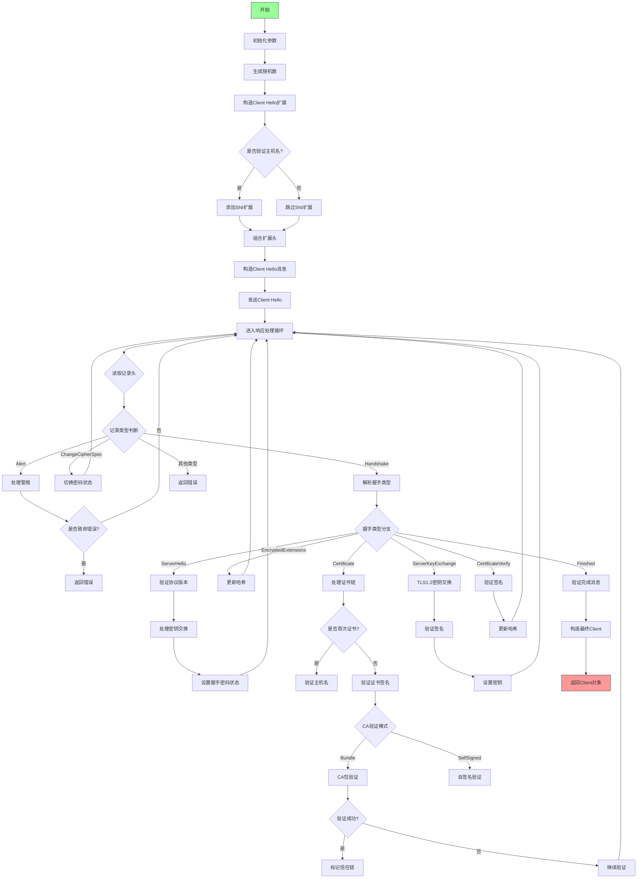

嗯，我现在需要帮用户用Mermaid画出一个Zig函数的流程图。这个函数是TLS客户端的初始化函数，看起来挺复杂的。首先，我需要理解这个函数的大致流程。

首先，函数名为init，接受一个stream和options参数，返回Client或者错误。函数一开始处理options中的host，根据是否验证主机名来决定host的值。然后生成随机数作为client_hello的随机数，还有一些密钥相关的操作，比如KeyShare的初始化。

接下来构造Client Hello消息，包括各种扩展字段，比如支持的TLS版本、签名算法、支持的群组等。然后处理服务器名称扩展（SNI），根据是否验证主机名来决定是否包含这个扩展。

构造完Client Hello后，发送给服务器。然后进入循环处理服务器的响应，解析不同类型的记录，比如握手、警报、改变密码规范等。根据TLS版本（1.2或1.3）的不同，处理方式也不同，比如解密数据、验证证书链、处理密钥交换等。

在处理握手消息时，可能遇到Server Hello、Encrypted Extensions、Certificate、Certificate Verify、Finished等步骤。每个步骤需要更新哈希、验证签名、处理密钥派生等。最后，建立应用层加密参数，返回Client结构体。

我需要将这些步骤分解成流程图中的各个节点。可能的流程分支包括TLS版本的不同处理，是否验证主机名，证书验证的不同情况（如自签名、CA包验证等），以及处理各种握手消息的顺序。

需要注意的是，函数中有多个状态变量，比如handshake_state，控制流程的走向。同时，错误处理部分也需要在流程图中体现，比如遇到非法参数或未预期消息时的错误返回。

可能的结构是：开始 -> 初始化参数 -> 构造Client Hello -> 发送 -> 进入循环处理响应 -> 根据消息类型处理 -> 验证证书 -> 完成握手 -> 返回Client。每个步骤中根据条件分支处理不同的情况。

接下来需要将这些步骤转化为Mermaid的节点和箭头，注意条件判断和循环结构。可能需要使用子图来表示循环处理过程，以及不同TLS版本的处理分支。
================================================
