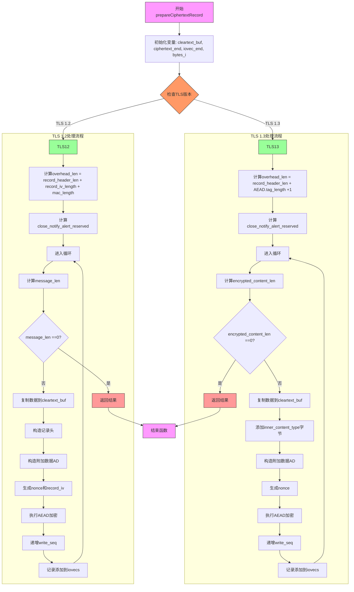

嗯，我需要帮用户用Mermaid画出一个Zig函数的流程图。这个函数是`prepareCiphertextRecord`，看起来是处理TLS客户端加密记录的。首先，我得理解这个函数的结构和逻辑。

首先，函数接收一些参数，包括客户端结构体指针、iovecs数组、缓冲区等。然后根据不同的TLS版本（1.3和1.2）有不同的处理逻辑。我需要分别处理这两个分支。

函数开始时会声明一些变量，比如cleartext_buf，ciphertext_end等。然后进入一个switch语句，根据c.application_cipher和c.tls_version来判断是TLS 1.3还是1.2。

对于TLS 1.3的情况，计算overhead_len，进入一个循环，处理加密内容。每一步包括复制明文到cleartext_buf，添加内容类型字节，生成AD（附加数据），构造nonce，进行加密，然后更新write_seq，最后将记录添加到iovecs中。循环直到没有数据可处理。

对于TLS 1.2的情况，同样有类似的步骤，但结构略有不同，比如记录头的构造、nonce生成方式不同，加密过程可能涉及MAC计算。同样有一个循环处理数据块，直到完成。

需要注意循环中的退出条件，当encrypted_content_len或message_len为0时返回结果。此外，两个版本在生成nonce和AD时使用的参数不同，需要正确区分。

接下来，我需要将这些步骤转化为流程图。首先确定大的分支：TLS 1.3和TLS 1.2。每个分支内部有循环处理数据块。每个循环内部有多个步骤：复制数据、添加内容类型、生成AD、nonce、加密、更新序列号、添加到iovecs等。

可能的流程图结构是：

1. 函数开始
2. 初始化变量（cleartext_buf, ciphertext_end等）
3. 根据TLS版本分支
   a. TLS 1.3分支
      i. 计算overhead_len和保留空间
      ii. 进入循环
         - 计算encrypted_content_len
         - 如果为0，返回结果
         - 复制数据到cleartext_buf
         - 添加inner_content_type
         - 生成AD
         - 生成nonce
         - 执行加密
         - 更新write_seq
         - 添加记录到iovecs
         - 继续循环
   b. TLS 1.2分支
      i. 类似结构，但步骤细节不同
4. 返回结果

需要注意的是，两个分支的循环结构相似，但具体步骤不同，比如AD的构造、nonce生成方式、加密参数等。此外，TLS 1.3在加密后有一个额外的标签（auth_tag），而TLS 1.2可能有不同的处理方式。

在绘制Mermaid流程图时，需要将这些步骤用节点表示，并用箭头连接。分支用条件判断节点，循环用循环节点或重复的步骤。

可能需要处理循环中的条件判断，比如计算encrypted_content_len是否为0，决定是否退出循环。每个循环内的步骤需要详细展开。

最终，确保流程图清晰展示两个TLS版本的处理流程，以及每个版本内部的循环和操作步骤。
================================================
