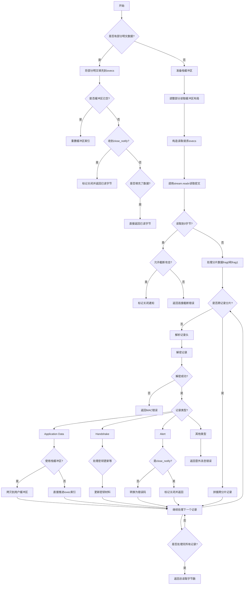

嗯，我需要为这个用 Zig 编写的 TLS 客户端读取函数绘制流程图。首先，我得仔细阅读代码，理解每个步骤的作用。看起来这个函数主要是处理从流中读取数据，解密后填充到用户提供的缓冲区（iovecs）中。

首先，函数开始处理部分已读取的明文缓冲区（partial_cleartext）。如果有数据，就尝试填充到用户的iovecs中，并更新相关索引。如果缓冲区被清空，重置索引。如果收到关闭通知（close_notify），则处理并返回已读取的字节数。

接下来，处理未接收关闭通知的情况，准备一些栈上的缓冲区用于存储密文和明文。这里涉及到计算用户缓冲区的可用空间，分配部分用于存储密文，另一部分用于明文。然后调整部分读取缓冲区的布局，确保可以容纳至少一个完整的记录。

然后，构造两个iovec结构，分别指向部分读取缓冲区和栈上的密文缓冲区。计算需要读取的长度，并调用stream.readv读取数据。如果实际读取到0字节，根据是否允许截断攻击进行处理。

处理读取到的密文数据，可能需要处理跨两个片段的记录（frag0和frag1），特别是当记录跨越这两个片段时，需要进行内存拷贝来拼接完整的记录。这里通过循环处理每个记录，解析记录头，解密数据，并根据内容类型（application_data、alert、handshake等）进行不同的处理。

解密过程中，针对TLS 1.3和TLS 1.2有不同的处理逻辑，包括生成nonce、解密数据、处理可能的错误（如错误的MAC）。解密后的明文数据会被填充到用户的iovecs中，或者临时存储在栈缓冲区后再复制到用户缓冲区。

对于处理handshake消息，如新的会话票据或密钥更新，函数会更新相关的密钥材料。如果是应用数据，则根据缓冲区的情况决定直接填充还是需要拷贝。遇到关闭通知时，标记并返回。

整个过程需要处理多种边界情况，如缓冲区不足、记录跨片段、错误处理等。绘制流程图时，需要将这些步骤分解成不同的判断和处理分支，确保每个可能的路径都被覆盖。可能需要使用多个决策节点来表示条件判断，如是否有部分明文、是否收到关闭通知、记录是否跨片段、解密是否成功等。同时，循环处理每个记录也需要在流程图中体现出来。
================================================
