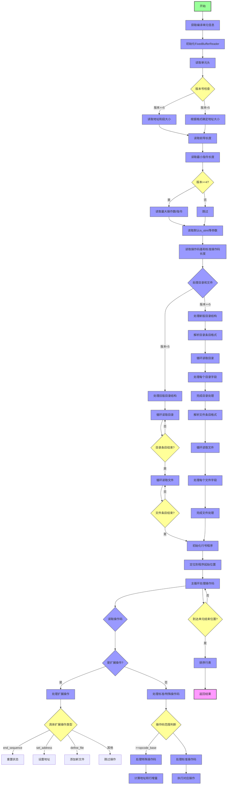

嗯，我需要为这个用 Zig 写的函数画一个流程图。首先，我需要理解这个函数的结构和逻辑流程。看起来这个函数是处理 DWARF 调试信息的行号程序。让我先通读一遍代码，看看主要步骤是什么。

函数开始于获取编译单元的当前工作目录和行信息偏移量。接着创建了一个 FixedBufferReader，并定位到指定的偏移位置。然后读取单元头，检查版本号和地址大小等信息。接下来处理目录和文件条目，根据不同的版本（比如版本5与其他版本）有不同的处理逻辑。之后进入主循环处理操作码，包括扩展操作和标准操作码。最后对行表进行排序，并返回结果。

流程图应该包括这些主要步骤：初始化、读取头信息、处理目录和文件、处理操作码循环、排序、返回结果。需要注意条件分支，比如不同版本的 DWARF 处理方式不同，以及各种错误检查。每个步骤之间的逻辑连接要清晰，特别是循环和条件判断的地方。

可能需要注意的细节包括：在版本5和旧版本中处理目录和文件的方式不同，扩展操作码的处理，以及主循环中对不同操作码的分支处理。错误处理部分（如返回bad()或missing()）也需要在流程图中体现出来。

接下来，我需要将这些步骤转化为Mermaid的流程图语法，确保每个节点和分支正确对应代码中的逻辑。需要特别注意循环结构，比如处理目录和文件的循环，以及处理操作码的主循环。另外，条件判断如版本检查、操作码类型判断等，都要用菱形节点表示判断分支。

可能遇到的困难是如何准确表示嵌套的条件和循环结构，确保流程图的准确性。此外，代码中存在多个错误返回点，这些也需要在流程图中明确标出。需要反复检查代码逻辑，确保每个步骤都被正确转换到流程图中。
================================================
