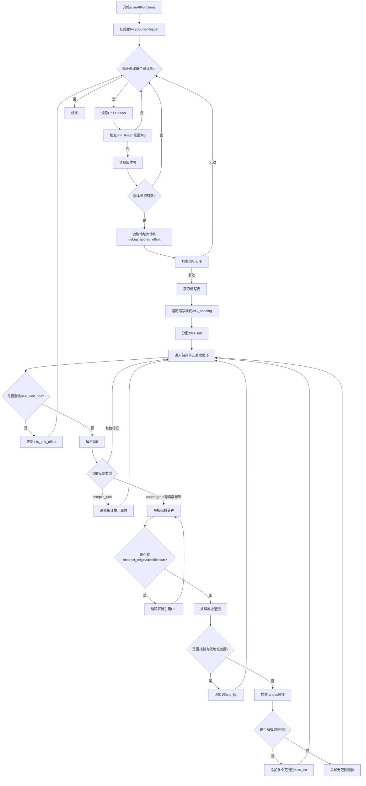

好的，我现在需要为这个Zig函数`scanAllFunctions`画一个流程图。首先，我需要理解这个函数的结构和逻辑。这个函数似乎是在处理DWARF调试信息，遍历所有的编译单元（Compilation Units），然后解析其中的函数信息，比如子程序、内联子程序等。

首先，函数开始于初始化`FixedBufferReader`，然后进入一个循环，处理每个编译单元。每个编译单元都有一个头部，需要读取版本、地址大小、调试缩写表偏移等信息。接着，获取缩写表，并处理其中的条目，寻找特定的Zig填充缩写代码。

在处理编译单元的过程中，会进入另一个循环，解析每个DIE（Debugging Information Entry）。根据DIE的标签（如`compile_unit`或各种函数标签），执行不同的操作，比如设置编译单元的信息，或者解析函数名称和地址范围，并将它们添加到函数列表中。

接下来，我需要将这些步骤转化为流程图的结构。流程图的开始是函数入口，然后是一个循环处理每个编译单元。每个编译单元内部又有一个循环处理DIE条目。对于每个DIE，根据标签类型分支处理，特别是处理函数相关的标签时，需要进一步解析名称和地址范围，并处理可能的引用（如`abstract_origin`和`specification`）。

需要注意错误处理和条件判断，比如版本检查、地址大小验证，以及处理属性时的各种条件分支。此外，内存管理和缓冲区的分配与释放也需要在流程中体现，比如`attrs_buf`的分配和释放。

在绘制流程图时，使用不同的节点表示开始、结束、处理步骤、条件判断、循环和子流程。例如，主循环处理每个编译单元，内部循环处理每个DIE，然后根据DIE的标签进行不同的处理。对于函数标签，进一步处理名称和地址范围，可能涉及递归解析其他DIE。

需要确保流程图的逻辑清晰，每个步骤和判断都有对应的节点，并且循环和分支结构正确表示。同时，注意错误处理路径，比如返回错误或跳转到错误处理部分。

最后，检查流程图是否覆盖了所有重要的步骤和分支，确保没有遗漏关键逻辑，比如处理不同版本的DWARF头部、地址大小的检查、函数名称的解析，以及地址范围的添加等。
================================================

这个流程图展示了：
1. 外层循环处理所有编译单元
2. 内层循环处理每个编译单元中的DIE
3. 对compile_unit类型DIE的特殊处理
4. 对函数类型DIE的递归属性解析流程
5. 地址范围处理的三重检查机制（low_pc/high_pc、ranges属性、无范围情况）
6. 错误检查和内存管理的关键节点
7. 处理DWARF格式版本差异的逻辑分支