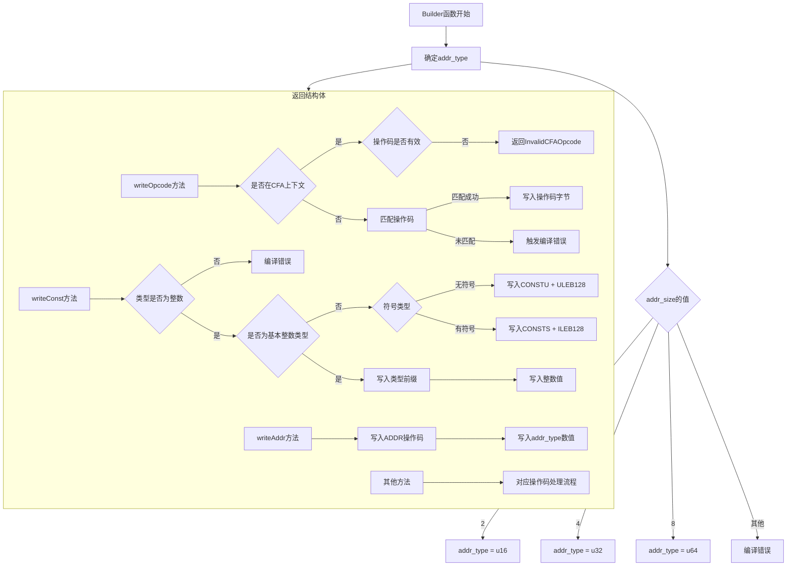

好的，我现在需要为一个用Zig编写的函数生成流程图。首先，我需要理解这个函数的结构和逻辑。这个函数叫做`Builder`，它接受一个编译时的`Options`参数，并返回一个结构体类型。结构体内部有多个方法，每个方法处理不同的操作码写入逻辑。

首先，我需要确定如何将这样的函数转换为流程图。通常，流程图会从起点开始，然后根据不同的条件分支展开。但由于这是一个生成结构体的函数，每个方法可能对应不同的流程。不过，用户可能希望看到整个`Builder`函数的流程，或者更可能的是，结构体中各个方法的流程。

不过，根据问题描述，“画出函数的流程图”，可能指的是整个`Builder`函数的流程。但`Builder`函数本身是一个返回结构体的函数，可能流程主要集中在结构体方法的逻辑上。不过，可能用户希望的是每个方法的流程图，或者整个生成结构体的流程。

考虑到代码中的`Builder`函数主要定义了一个结构体，该结构体有多个写入操作的方法，每个方法处理不同的操作码和参数。例如，`writeOpcode`方法处理零操作码指令，`writeLiteral`处理文字编码，等等。

因此，可能需要为每个主要的公共方法绘制流程图，比如`writeOpcode`、`writeConst`、`writeAddr`等。但问题可能希望有一个整体的流程图，或者选择其中一个方法进行详细说明。不过，用户提供的整个代码，可能希望覆盖整个生成的结构体的流程。

不过，由于整个结构体有很多方法，每个方法都有不同的逻辑，可能需要一个高层次的流程图，展示各个方法的调用关系和主要分支。或者，可能需要选择一个代表性的方法，如`writeOpcode`，来详细绘制其流程图。

考虑到用户可能希望一个整体的结构图，而不是每个方法的详细流程，可能需要使用Mermaid的结构图（如类图）来表示生成的struct及其方法。但用户明确提到“流程图”，所以可能需要过程流程图。

另一个可能性是，整个`Builder`函数根据传入的`options`生成不同的结构体类型，例如`addr_type`的选择。这可能是一个分支点，需要体现在流程图中。

但可能更合理的是，用户希望看到`Builder`函数内部的结构体方法的逻辑流程，比如每个方法如何处理输入参数，条件判断，错误处理等。

例如，以`writeOpcode`方法为例，流程如下：

1. 检查是否在调用帧上下文中，且操作码是否有效。
2. 根据操作码的不同，执行不同的写入操作。
3. 如果操作码在允许的列表中，写入字节。
4. 否则，触发编译错误。

这样的条件分支可以用流程图中的判断节点表示。

同样，`writeConst`方法需要根据类型T的不同选择不同的处理路径，比如是否是基本整数类型，还是需要变长编码（LEB128）。

因此，可能需要为每个方法绘制流程图。但考虑到篇幅，可能选择几个主要方法，或者综合整个结构体的逻辑。

不过，用户可能希望一个整体的高层次流程图，展示`Builder`函数如何根据`options`生成结构体，结构体中的各个方法如何根据参数处理写入操作。

可能的结构：

- `Builder`函数开始
  - 确定`addr_type`基于`options.addr_size`
  - 返回生成的结构体
    - 结构体包含多个写入方法（如writeOpcode, writeLiteral等）
      - 每个方法内部的条件判断和操作

但这样可能过于笼统，无法体现具体逻辑。可能需要更详细的步骤。

例如，对于`writeOpcode`：

开始
检查options.call_frame_context和操作码是否有效
如果无效，返回错误
否则，匹配操作码
如果操作码在允许的列表中，写入字节
否则，触发编译错误

这样可以用流程图表示。

综上所述，由于代码中有多个方法，每个方法有各自的逻辑，可能需要为每个方法绘制流程图。但用户可能希望一个总览，或者以主要方法为例。

由于用户提供的代码较多，可能需要简化，选择几个关键方法进行流程图的绘制，或者用一个综合的流程图来表示整个结构体的逻辑。

现在，我需要根据以上分析，使用Mermaid语法绘制一个或多个流程图。可能需要选择主要的方法如`writeOpcode`和`writeConst`作为例子，或者展示整个结构体的生成流程。

但根据问题描述，用户可能希望一个整体的流程图，涵盖`Builder`函数的执行流程，包括生成结构体和结构体中的方法逻辑。然而，这样的流程图可能过于复杂。

另一种可能是，将整个`Builder`函数视为一个生成结构体的过程，流程包括：

1. 根据`options.addr_size`确定`addr_type`。
2. 定义并返回结构体，其中包含各种写入方法。
3. 每个写入方法内部的处理流程。

例如，`writeOpcode`方法的流程图：

开始 -> 检查是否在call_frame_context且操作码无效？ -> 是：返回错误；否：继续
-> 匹配操作码到允许列表 -> 存在：写入字节；不存在：编译错误

因此，最终可能需要用Mermaid绘制多个流程图，或选择一个代表性的方法。但用户可能希望整个函数的流程图，因此需要综合处理。
================================================

这个流程图展示了：
1. Builder函数的初始地址类型选择逻辑
2. 返回结构体包含的主要方法流程：
   - writeOpcode：包含CFA上下文检查和操作码验证
   - writeConst：类型检查和不同编码路径
   - writeAddr：直接写入操作
   - 其他方法的概括表示
3. 通过条件分支展示不同的处理路径
4. 错误处理和编译时检查的路径