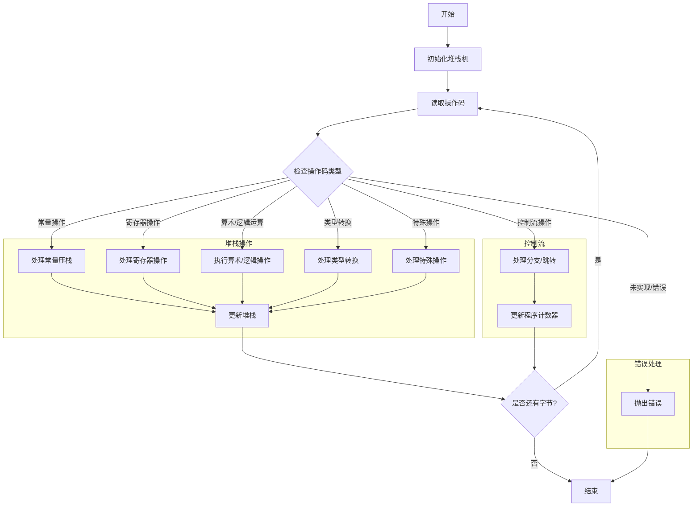

嗯，我需要用Mermaid画出这个Zig函数的流程图。首先，我得理解这段代码的结构和逻辑。这个函数是定义了一个堆栈机器，用于处理DWARF表达式。看起来主要包含读取操作数、执行操作码、管理堆栈等部分。

首先，函数`StackMachine`接受一个编译时的`Options`参数，返回一个结构体类型。这个结构体内部定义了`Operand`和`Value`的联合类型，以及堆栈相关的操作，比如`reset`、`deinit`等。接下来是`readOperand`函数，根据不同的操作码从流中读取操作数。然后，`run`和`step`函数负责执行表达式，处理各种操作码，进行算术、逻辑运算，控制流操作等。

接下来，我需要确定流程图的主要部分。可能包括：

1. 初始化堆栈机。
2. 读取操作码。
3. 根据操作码读取操作数。
4. 执行对应的操作（如压栈、弹栈、算术运算等）。
5. 处理控制流（如分支、跳转）。
6. 处理错误和未实现的操作码。

需要注意的是，`step`函数中的switch语句处理了众多的操作码，每个case对应不同的操作。这可能需要在流程图中分支出多个路径，每个操作码对应不同的处理流程。

另外，错误处理也是一个重要部分，比如`error.InvalidExpression`、`error.UnimplementedOpcode`等，应该在流程图中体现出来。

可能的结构：

- 开始 -> 初始化堆栈 -> 读取操作码 -> 判断操作码类型 -> 执行对应操作 -> 更新堆栈/指针 -> 是否有更多操作码？是则循环，否则结束。
- 每个操作码类型（如常量压栈、寄存器操作、算术运算等）需要不同的处理分支。
- 错误处理分支，遇到错误时终止流程。

需要简化复杂的操作码处理，避免流程图过于冗杂。可以将常见操作归类，如堆栈操作、算术运算、控制流等，用子流程表示。

最终，用Mermaid的流程图语法将这些步骤和分支结构表达出来，确保逻辑清晰，层次分明。
================================================

### 关键节点说明：
1. **初始化堆栈机**：创建堆栈结构并准备执行环境。
2. **读取操作码**：从输入流中读取当前操作码。
3. **操作码分派**：根据操作码类型进入不同处理分支：
   - **常量操作**：如`OP.const1u`将立即数压入堆栈。
   - **寄存器操作**：如`OP.bregx`读取寄存器值并计算偏移。
   - **算术/逻辑运算**：如`OP.add`执行加法并更新堆栈。
   - **控制流操作**：如`OP.bra`根据条件跳转到目标地址。
   - **类型转换**：如`OP.convert`处理类型重新解释。
   - **特殊操作**：如`OP.entry_value`处理子表达式求值。
4. **错误处理**：遇到未实现或非法操作码时终止流程。
5. **循环控制**：检查输入流是否还有未处理字节，决定继续执行或结束。