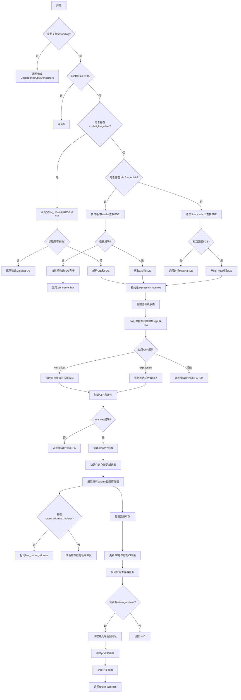

嗯，我需要为这个Zig函数`unwindFrameDwarf`画一个流程图。首先，我应该通读整个函数，理解它的主要步骤和逻辑分支。

函数开头检查是否支持unwinding，如果不支持则返回错误。接着检查`context.pc`是否为0，如果是的话直接返回0。这部分应该对应流程图中的两个判断框。

接下来，函数尝试获取FDE和CIE。这里有两个分支：如果提供了`explicit_fde_offset`，则直接读取对应的FDE和CIE；否则，尝试使用`.eh_frame_hdr`查找，如果失败则回退到扫描整个`.eh_frame`或`.debug_frame`。这里可能有多个条件判断，比如是否有`explicit_fde_offset`，`.eh_frame_hdr`是否存在，查找是否成功等。这些分支需要在流程图中体现。

然后，函数设置`expression_context`和一些上下文变量，运行虚拟机到本地代码，处理CFA规则，可能是基于寄存器值或表达式计算。处理完CFA后，检查其有效性。

接着是更新寄存器的部分，使用arena分配器来管理临时数据，处理每个寄存器的更新，最后将更新后的值复制回目标寄存器。这部分可能涉及循环处理每个寄存器列。

之后，处理返回地址，考虑是否减去1以避免错误的FDE查找。最后返回`return_address`。

在画流程图时，需要注意各个条件分支的路径，比如错误处理、不同情况下的FDE/CIE获取方式、CFA规则的不同处理等。此外，循环结构（如处理每个寄存器列）也需要正确表示。

可能需要将整个流程分为几个主要部分：初始化检查、获取FDE/CIE、设置上下文和运行虚拟机、处理CFA、更新寄存器、处理返回地址和最终返回。每个部分内部的条件和操作需要详细展开。

需要注意的是，代码中有多个错误处理（try语句），这些在流程图中可能表现为带有错误出口的菱形判断框。同时，内存访问、分配器使用等步骤也需要适当体现。

最后，确保流程图的连贯性，每个步骤之间的转换要清晰，特别是分支和循环结构。
================================================
