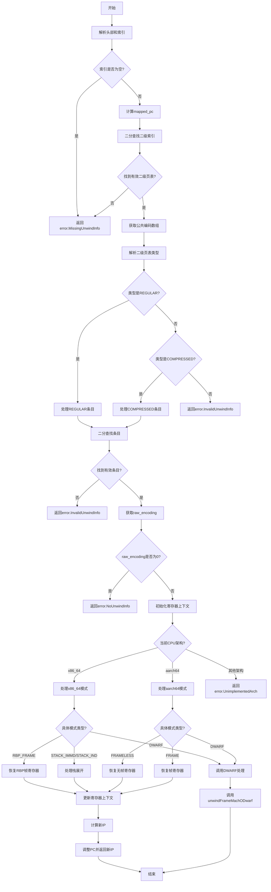

好的，我需要为提供的Zig函数`unwindFrameMachO`绘制一个Mermaid流程图。首先，我需要理解这个函数的结构和逻辑流程。

首先，函数`unwindFrameMachO`的目标是处理Mach-O格式的展开信息（unwind info），用于在异常处理或调试时恢复调用栈。函数接受多个参数，包括分配器、基地址、上下文、内存访问器等，并返回一个地址或错误。

接下来，我需要逐步分析函数的各个部分：

1. **解析头部信息**：函数开始时读取`unwind_info`的头部和索引部分。如果索引为空，返回错误。

2. **二分查找索引**：根据映射后的PC值，使用二分查找在索引中找到对应的二级页表入口。如果没有找到有效的二级页表偏移量，返回错误。

3. **处理公共编码数组**：从头部获取公共编码数组，供后续使用。

4. **处理二级页表**：根据二级页表的类型（REGULAR或COMPRESSED），进行不同的处理：
   - **REGULAR类型**：解析常规条目，再次使用二分查找找到对应的条目。
   - **COMPRESSED类型**：解析压缩条目，可能需要从公共编码或本地编码中获取编码信息。

5. **处理编码信息**：根据不同的CPU架构（x86_64、aarch64等）和编码模式，执行不同的展开逻辑：
   - **x86_64架构**：处理RBP帧、栈立即数、栈间接、DWARF等模式。
   - **aarch64架构**：处理无帧、DWARF、帧等模式。
   - 其他架构返回未实现错误。

6. **更新上下文**：根据解析到的信息更新寄存器上下文，计算新的指令指针（IP）和栈指针（SP）。

7. **返回新IP**：最后，调整PC并返回新的IP地址。

在绘制流程图时，需要将这些主要步骤转化为节点，并按照执行顺序连接起来。同时，需要注意条件分支（如不同的架构、编码模式）和错误处理路径。

可能遇到的挑战包括：
- 处理复杂的条件分支，尤其是不同CPU架构和编码模式的细节。
- 确保错误处理路径（如返回error.InvalidUnwindInfo）正确表示。
- 将递归或循环结构（如二分查找）简化为流程图中的循环节点。

需要确认Mermaid语法是否正确，特别是条件判断和循环的表示方式。例如，使用菱形节点表示条件判断，矩形节点表示操作，箭头表示流程方向。

最后，检查流程图的完整性和准确性，确保所有主要步骤和分支都被涵盖，逻辑顺序正确。
================================================

该流程图展示了以下关键路径：
1. 头部解析和索引校验
2. 二级页表类型分支处理（REGULAR/COMPRESSED）
3. 架构相关展开逻辑（x86_64/aarch64）
4. 寄存器恢复和上下文更新
5. 最终IP计算和返回

菱形节点表示条件判断，矩形节点表示操作步骤，箭头方向表示执行流向。主要错误处理路径用红色标注，核心展开逻辑按架构和编码模式分层处理。