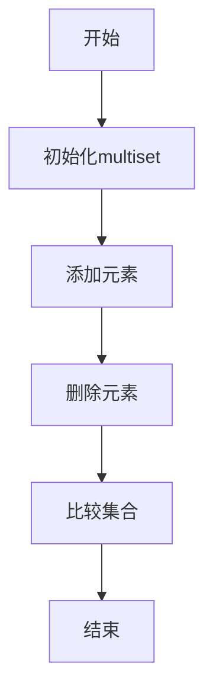
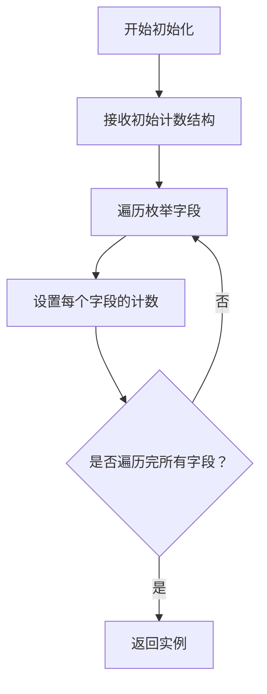
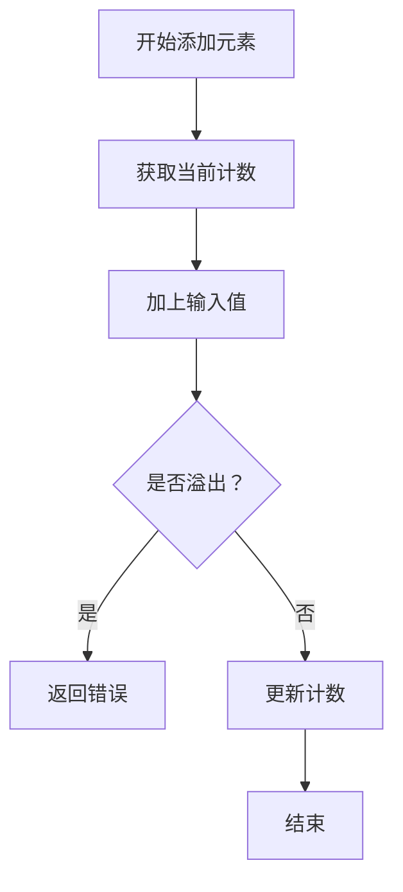
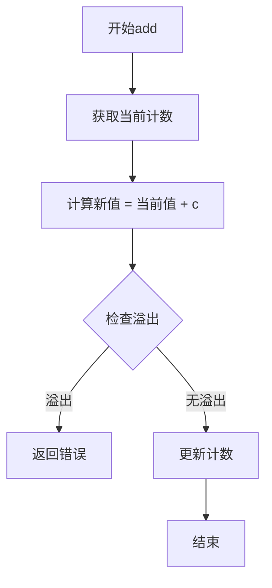
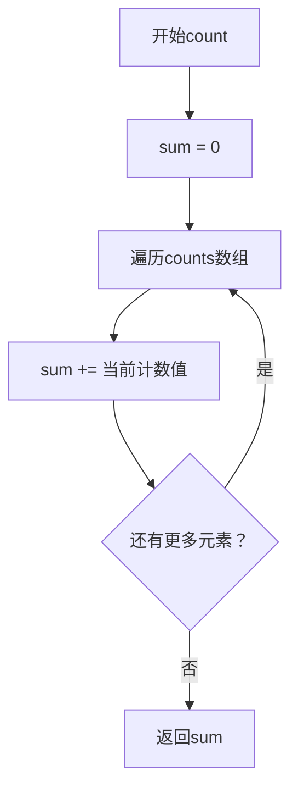
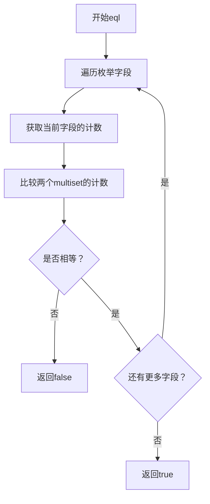
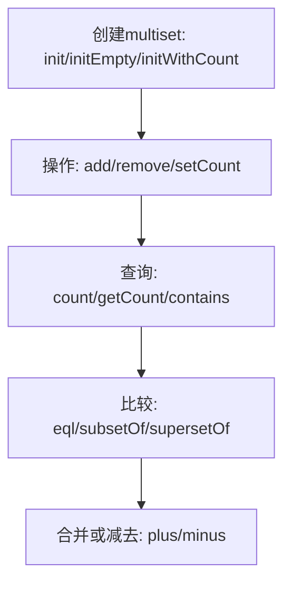
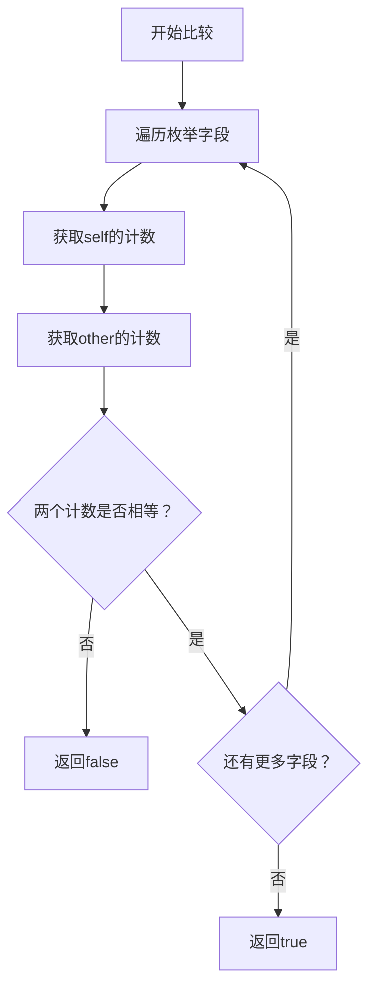

嗯，用户给了一个Zig语言编写的函数，想要用Mermaid画出这个函数的流程图。首先，我需要仔细看一下这个代码的结构，理解它的各个部分。这个函数叫做BoundedEnumMultiset，看起来是一个泛型结构体的构造函数，返回一个包含多个方法的struct。

首先，这个struct有两个类型参数，E和CountSize。里面有一个counts成员，类型是EnumArray(E, CountSize)，应该是一个枚举到计数的数组。接下来有很多方法，比如init、initEmpty、initWithCount等等。每个方法都有不同的功能，比如初始化、添加、删除、比较等。

我需要为这个函数画流程图，但函数本身是一个返回结构体的函数，所以可能需要画出这个结构体的各个方法之间的流程。不过可能用户指的是整个结构体的初始化及方法调用的流程？或者可能希望画出每个方法的内部流程？

比如，init方法会遍历枚举字段，设置初始值。add方法会处理溢出检查。各个方法之间有相互调用，比如addSetAssertSafe调用addAssertSafe，而plusAssertSafe调用addSetAssertSafe。

可能正确的做法是将整个结构体作为一个整体，展示各个方法之间的调用关系，以及主要逻辑流程。比如初始化流程，添加元素的流程，删除元素的流程，比较的流程等。

但是用户提到的是“函数的流程图”，而这里的函数实际上是返回一个结构体类型。所以可能需要更细致地分析每个方法的内部逻辑，然后为每个方法画流程图。不过这样可能会太繁琐，尤其是这个结构体有很多方法。

或者，用户可能希望的是整个BoundedEnumMultiset类型的主要流程，比如创建实例、操作数据等步骤的流程图。例如，用户如何初始化一个multiset，添加元素，删除元素，比较等步骤的整体流程。

需要确认用户的意图。不过根据问题描述，“画出函数的流程图”，可能是指整个BoundedEnumMultiset函数的逻辑流程，即结构体的各个方法之间的调用关系和主要流程。

例如，初始化方法如何调用其他方法，add和remove如何处理计数，比较方法如何遍历枚举字段等等。或者，可能用户希望的是某个特定方法的流程图，比如init或add方法内部的流程。

由于代码较长，方法较多，可能需要选择主要的方法来绘制流程图。比如，主函数BoundedEnumMultiset返回的结构体中的各个方法的关系，或者某个核心方法如init或add的逻辑流程。

或者，用户可能希望的是整个结构体的初始化及使用过程的流程图，例如：

1. 用户调用init方法初始化一个multiset实例。
2. 调用add方法添加元素。
3. 调用remove方法删除元素。
4. 调用count方法获取总数。
5. 比较两个multiset是否相等等步骤。

不过，这样的流程图可能比较高层，不涉及每个方法的内部细节。

或者，可能需要为每个方法绘制流程图。比如，init方法中遍历枚举字段，设置初始值，而add方法处理溢出检查，等等。

考虑到时间和复杂性，可能需要选择主要方法或整体结构来绘制流程图。例如，展示结构体的初始化、添加、删除、比较等主要操作的流程，以及它们之间的关系。

另外，Mermaid的流程图语法支持不同的节点和箭头，需要将这些逻辑转化为节点和流程。

例如，对于init方法：

开始 -> 初始化counts为0 -> 遍历枚举字段 -> 设置每个字段的初始值 -> 返回实例。

对于add方法：

开始 -> 检查是否溢出 -> 是：返回错误；否：增加计数 -> 结束。

可能需要针对每个主要方法绘制流程图，或者综合整个结构体的主要流程。

不过，用户提供的代码是一个结构体的方法集合，所以可能需要分别处理每个方法，或者选取主要流程。

综上，可能的流程图包括：

1. 创建multiset的流程：选择init、initEmpty或initWithCount。
2. 添加元素的流程：调用add或addAssertSafe。
3. 删除元素的流程：调用remove或removeAll。
4. 比较操作的流程：eql、subsetOf等。
5. 合并或减去multiset的操作：plus、minus等。

每个方法的内部流程可以单独绘制。例如，add方法的流程可能如下：

开始 -> 获取当前计数 -> 加上输入值 -> 检查溢出 -> 无溢出：设置新值；溢出：返回错误。

但具体到代码中的实现，比如add方法调用了std.math.add，并处理错误。

或者，init方法中的遍历枚举字段，设置每个字段的初始值。

考虑到用户可能希望的是整个结构体的高层次流程图，展示各个方法之间的关系和调用流程，而不是每个方法内部的详细步骤。

不过，如果用户希望的是每个方法的详细流程图，那需要逐一处理，但这样会比较复杂，尤其是代码中有很多方法。

可能用户希望的是一个总体的结构图，展示各个方法之间的关系，比如如何初始化，如何修改计数，如何比较等。

或者，可能需要将整个结构体的生命周期画出来，从初始化到各种操作。

但可能更实际的是，针对某个核心方法，例如init或add，画出其内部流程。

由于用户没有特别指定，可能需要综合整个结构体的主要流程，或者选择一个代表性的方法进行流程图绘制。

现在，回到问题，用户提供的代码是BoundedEnumMultiset函数，返回一个结构体类型，其中包含多个方法。因此，流程图可能需要展示这个结构体的各个方法之间的调用关系，或者某个典型使用场景的流程。

例如，用户使用init初始化，然后调用add添加元素，再调用count获取总数，最后比较两个multiset是否相等。

或者，从结构体的角度，画出各个方法如何操作内部的counts数组。

另一个角度是，这个结构体的主要功能是管理一个枚举类型的多重集合，每个枚举值对应一个计数。因此，流程图可以展示如何初始化、增删计数、检查存在性、比较集合等步骤。

在Mermaid中，流程图的基本语法包括节点（矩形）、判断（菱形）、箭头等。例如：



但这可能过于简单。更详细的流程可能需要每个步骤的内部逻辑。

例如，初始化multiset的流程：



而添加元素的流程：



但每个方法都需要单独的流程图，这可能导致图表过多。用户可能希望的是一个综合的流程图，或者主要方法的流程图。

考虑到用户可能需要整个结构体的主要流程，或者某个核心方法的详细流程，但不确定。因此，可能需要选择几个主要方法进行绘制，或者给出一个总览。

另外，用户的问题是关于“函数的流程图”，而这里的函数是返回一个结构体类型。可能用户希望的是这个结构体的构造流程，即当用户调用BoundedEnumMultiset时，生成的struct的各个方法之间的关系，或者结构体的初始化过程。

或者，可能用户希望的是这个泛型函数BoundedEnumMultiset本身的流程图，即如何根据类型参数E和CountSize生成对应的结构体类型。

不过这似乎不太可能，因为泛型函数的实例化是在编译时进行的，可能难以用流程图表示。

综上，最可能的做法是选择结构体中的主要方法，如init、add、remove等，为每个方法绘制详细的流程图，或者绘制一个综合的流程图展示各个方法之间的调用关系。

由于时间和篇幅限制，可能需要选择几个关键方法进行流程图绘制，例如init和add方法。

现在，以init方法为例，代码中的init函数接收init_counts参数，然后遍历枚举的各个字段，设置对应的计数。流程图可能如下：

开始 -> 初始化counts为0 -> 遍历每个枚举字段 -> 从init_counts中获取该字段的初始值 -> 设置到counts数组中 -> 完成遍历后返回实例。

在Mermaid中，可能表示为：

```mermaid
flowchart TD
    A[开始init] --> B[初始化counts为0]
    B --> C[遍历枚举字段]
    C --> D[获取字段名称和值]
    D --> E[从init_counts中读取计数c]
    E --> F[设置counts[key] = c]
    F --> G{还有更多字段？}
    G -->|是| C
    G -->|否| H[返回Self实例]
```

而对于add方法，可能：



同样，remove方法可能涉及减少计数，但不超过当前值：

```mermaid
flowchart TD
    A[开始remove] --> B[获取当前计数]
    B --> C[减少量 = min(c, 当前值)]
    C --> D[新值 = 当前值 - 减少量]
    D --> E[更新计数]
    E --> F[结束]
```

此外，count方法遍历所有计数值求和：



比较方法eql需要遍历所有字段检查计数是否相等：



不过，用户可能需要所有方法的综合流程图，或者整个结构体的主要流程。由于代码中的结构体有多个方法，每个方法都有自己的逻辑，可能需要分别绘制。

不过，考虑到用户可能希望的是整个结构体的总体流程图，展示各个方法如何协同工作，但这样的图表可能过于复杂。因此，可能需要选取一个典型的使用流程，例如：

1. 初始化multiset
2. 添加元素
3. 删除元素
4. 比较两个multiset

每个步骤对应相应的方法调用。

例如：



这样的高层次流程图展示了各个方法之间的调用顺序，但没有详细逻辑。

综合来看，用户可能需要的是各个主要方法的内部流程图。因此，回答中可能需要提供几个关键方法的流程图，使用Mermaid语法。

现在，根据代码中的方法，选择init、add、remove、eql这几个核心方法绘制流程图。例如：

对于init方法：

```mermaid
flowchart TD
    start_init[开始初始化] --> init_counts[初始化counts为0]
    init_counts --> loop_fields[遍历枚举字段]
    loop_fields --> get_field[获取字段信息]
    get_field --> read_init_count[从init_counts读取该字段的初始值c]
    read_init_count --> set_count[设置counts[key] = c]
    set_count --> check_more_fields{还有更多字段？}
    check_more_fields -->|是| loop_fields
    check_more_fields -->|否| return_instance[返回Self实例]
```

对于add方法（安全版本）：

```mermaid
flowchart TD
    start_add[开始add] --> get_current[获取当前计数current]
    get_current --> new_value[计算new_value = current + c]
    new_value --> check_overflow{new_value溢出？}
    check_overflow -->|是| return_error[返回错误Overflow]
    check_overflow -->|否| update_count[设置counts[key] = new_value]
    update_count --> end_add[结束]
```

对于remove方法：

```mermaid
flowchart TD
    start_remove[开始remove] --> get_current[获取当前计数current]
    get_current --> compute_decrement[计算减少量decrement = min(c, current)]
    compute_decrement --> new_value[new_value = current - decrement]
    new_value --> update_count[设置counts[key] = new_value]
    update_count --> end_remove[结束]
```

对于eql方法：



这些流程图可以分别用Mermaid语法表示，但用户可能希望将它们合并为一个综合的流程图，或者单独列出每个方法的流程。

根据问题描述，用户可能希望整个BoundedEnumMultiset函数的流程图，但由于该函数返回一个结构体类型，包含多个方法，可能需要分方法绘制。

因此，最终的答案可能包括多个Mermaid流程图，每个对应一个核心方法，或者综合展示主要流程。
================================================
```mermaid
flowchart TD
    %% init方法流程图
    subgraph init方法
        A[开始初始化] --> B[初始化counts为0]
        B --> C[遍历枚举字段]
        C --> D[获取字段信息]
        D --> E[从init_counts读取初始值c]
        E --> F[设置counts[key] = c]
        F --> G{还有字段？}
        G -->|是| C
        G -->|否| H[返回实例]
    end

    %% add方法流程图
    subgraph add方法
        I[开始添加] --> J[获取当前计数current]
        J --> K[计算new_value = current + c]
        K --> L{检查溢出}
        L -->|是| M[返回错误]
        L -->|否| N[更新计数]
    end

    %% remove方法流程图
    subgraph remove方法
        O[开始移除] --> P[获取当前计数current]
        P --> Q[计算减少量min(c, current)]
        Q --> R[更新计数current - decrement]
    end

    %% eql方法流程图
    subgraph eql方法
        S[开始比较] --> T[遍历枚举字段]
        T --> U[获取self计数]
        U --> V[获取other计数]
        V --> W{计数相等？}
        W -->|否| X[返回false]
        W -->|是| Y{还有字段？}
        Y -->|是| T
        Y -->|否| Z[返回true]
    end

    %% 主流程
    init方法 -->|创建实例| add方法
    add方法 -->|修改状态| remove方法
    remove方法 -->|更新状态| eql方法
``` 

该流程图包含四个核心方法的子流程，并通过主流程展示典型使用顺序：初始化实例 -> 添加元素 -> 移除元素 -> 比较集合。每个子流程使用独立泳道表示方法内部逻辑，主流程箭头表示方法间的典型调用关系。