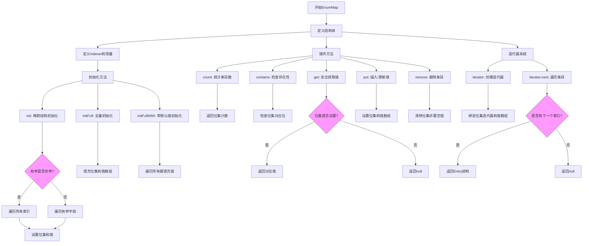

嗯，我需要帮用户用Mermaid画出他们提供的Zig函数`EnumMap`的流程图。首先，我要理解这个函数的结构和功能。看起来这是一个泛型函数，用于创建一个枚举到值的映射结构。结构体`EnumMap`包含位集和值数组，以及各种方法如初始化、获取、设置、删除条目等。

首先，我应该确定流程图的范围。用户可能希望整个`EnumMap`结构的流程图，包括各个方法之间的调用关系，或者每个方法的内部流程。但根据用户提供的代码，可能更倾向于展示`EnumMap`类型的主要方法及其逻辑流程。

接下来，我需要分析每个方法的主要步骤。例如，`init`方法根据提供的初始化值构建映射，处理枚举是否为穷举的情况。`initFull`则用单一值填充整个映射。`get`、`put`等方法涉及检查位集和操作数组。

考虑到Mermaid流程图通常展示步骤的顺序和判断分支，我需要为每个主要方法绘制相应的流程。但将所有方法放在一个流程图中可能会过于复杂。或许应该分别为每个主要方法绘制子图，然后展示它们如何关联。

例如，主流程图可以开始于创建EnumMap实例，然后分支到各个方法如init、put、get等。每个方法内部有具体的步骤，比如检查位集是否设置，访问数组值，处理错误情况等。

需要注意的是，Zig的一些特性如编译时执行（comptime）可能需要在流程图中特殊处理，但可能难以直观表示。可能需要简化这部分，专注于运行时逻辑。

最后，确保流程图的逻辑清晰，步骤正确，判断条件明确。可能需要多次校对代码逻辑，确保每个分支都被正确表示。
================================================

流程图说明：
1. 结构定义部分包含核心数据结构和常量
2. 初始化系统处理三种不同初始化方式，重点关注稀疏初始化的分支逻辑
3. 操作方法展示关键功能的核心流程，强调位集与值数组的联动
4. 迭代器系统显示遍历机制，通过位集迭代器驱动值访问
5. 菱形节点表示条件判断，用粉色背景突出逻辑分支