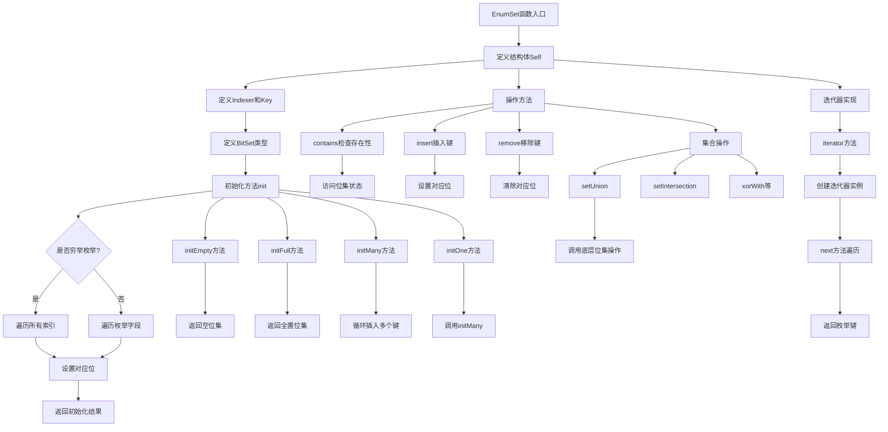

嗯，用户让我用Mermaid来画一个Zig函数的流程图。首先，我需要理解这个函数的结构和逻辑。这个函数名为`EnumSet`，看起来是一个泛型函数，接收一个枚举类型`E`，返回一个结构体类型。结构体里面有很多方法，比如初始化、插入、删除元素，以及集合的各种操作，如并集、交集等。

首先，我应该确定流程图的范围。用户提供的代码是一个完整的`pub fn EnumSet`函数，里面包含了多个方法和内部结构。流程图需要涵盖这个函数的主要逻辑，包括初始化、各种操作方法以及迭代器的实现。

接下来，我需要考虑如何将Zig代码转换为流程图的步骤。通常，流程图是从入口点开始，然后根据不同的操作分支展开。这里的入口点可能是`init`方法，然后其他方法如`insert`、`remove`、`setUnion`等作为不同的处理步骤。每个方法内部可能有自己的逻辑，比如`init`方法根据是否是可穷举的枚举类型有不同的处理路径。

另外，注意到代码中使用了`@setEvalBranchQuota`和`comptime`，这些是Zig的编译时特性，但在流程图中可能需要简化为条件判断或循环结构。例如，在`init`方法中，根据枚举是否是穷举的，使用不同的循环来设置位集。

还需要考虑结构体的各个方法之间的关系。例如，`initMany`调用`insert`方法，而`initOne`又调用`initMany`。在流程图中，这些调用关系需要被体现出来，可能通过子流程或函数调用的方式表示。

对于集合操作如`unionWith`、`intersectWith`等，它们的逻辑可能相对简单，直接调用底层位集的方法。这部分可以简化为一个步骤，指出调用对应的位集操作。

迭代器部分，`iterator`方法返回一个迭代器结构体，该结构体的`next`方法会遍历位集中的设置位，并返回对应的枚举键。这部分流程可以表示为一个循环，逐个检查位集中的位是否为1，并转换为枚举值。

在绘制流程图时，需要确保逻辑清晰，步骤分明，同时不过于复杂。可能需要将主要的方法作为不同的处理框，内部的条件和循环用分支和循环结构表示。此外，需要注意各个方法之间的调用关系和数据流动。

最后，根据Mermaid的语法，将上述逻辑转化为正确的节点和箭头。例如，使用矩形框表示处理步骤，菱形表示条件判断，箭头表示流程方向。可能需要将主要的方法如`init`、`insert`、`remove`等作为主流程的不同分支，而内部的具体逻辑则作为子流程展开。

需要注意的是，由于代码量较大，流程图可能会比较庞大。因此，可能需要分层绘制，先画出主函数的结构，再细化每个方法的具体流程。或者，选择重点部分进行绘制，如初始化过程和几个关键操作方法，避免流程图过于复杂难以理解。
================================================

该流程图展示了以下核心逻辑：
1. 结构体定义和基础类型初始化
2. 多种初始化方法的分支处理
3. 元素操作的核心路径（插入/删除/存在性检查）
4. 集合运算的底层调用
5. 迭代器的实现流程
使用条件判断和并行路径展示了穷举枚举和非穷举枚举的不同处理方式，以及各种初始化方法之间的关系。