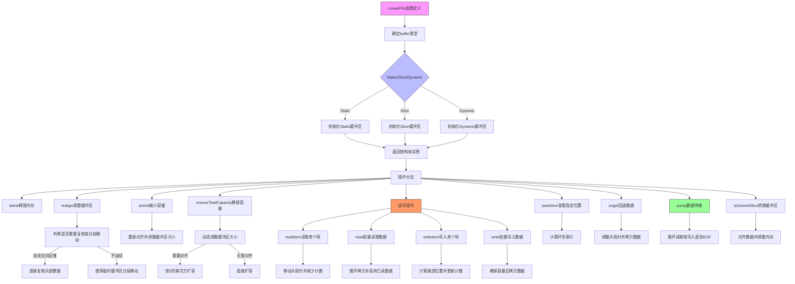

嗯，我需要为这个Zig语言编写的LinearFifo函数画一个流程图。首先，我得理解这段代码的结构和功能。看起来这是一个泛型实现的线性FIFO（先进先出）队列，支持静态、切片和动态缓冲区类型。函数返回一个结构体类型，包含初始化、释放、读写操作等方法。

首先，我应该确定流程图的入口点。入口应该是LinearFifo函数的定义，然后根据不同的buffer_type（Static、Slice、Dynamic）初始化不同的结构体实例。每个初始化方法（initStatic、initSlice、initDynamic）会有不同的流程。

接下来，结构体的各个方法需要被分解成流程图的各个节点。例如，deinit方法会根据是否是Dynamic类型来释放内存。realign方法会调整缓冲区的位置，确保数据连续存放。shrink和ensureTotalCapacity等方法处理缓冲区的容量调整。

读写操作如readItem、read、writeItem、write等需要各自的流程分支。特别是需要考虑缓冲区的环形特性，处理头尾指针的移动和环绕。此外，peekItem和unget方法涉及数据的查看和回退操作，也需要在流程图中体现。

还有pump方法，负责从读取器向写入器传输数据，需要循环处理直到EOF。最后，toOwnedSlice方法将缓冲区转换为拥有的切片，并调整内存。

需要注意的是，流程图中需要处理错误情况，例如内存分配失败时的错误处理，但原代码中有些方法直接返回错误，而有些通过assert来处理。需要确保这些情况在流程图中正确表示。

可能遇到的困难是如何将复杂的条件判断和循环结构清晰地用流程图表示出来，尤其是处理缓冲区头尾指针的移动和环形缓冲区的逻辑。需要分步骤分解每个方法的逻辑，确保每个判断和循环都有对应的节点和路径。

此外，考虑到代码中使用了Zig语言的特性，如comptime参数和泛型，流程图可能需要简化这些编译时逻辑，专注于运行时行为。例如，buffer_type在编译时确定，因此不同的初始化方法在流程图中应作为不同的分支处理。

最后，需要确保流程图的连贯性，从初始化到各种操作，再到资源释放，形成一个完整的生命周期。每个方法之间的调用关系也需要通过箭头正确连接，例如discard方法在readItem中被调用。

总结来说，流程图的绘制需要从函数入口开始，根据不同的初始化类型分支，然后逐步展开各个方法的逻辑，处理条件判断、循环和错误情况，确保每个步骤清晰可见，逻辑连贯。
================================================

该流程图展示了以下关键路径：
1. 初始化阶段根据buffer类型分支
2. 核心操作分为内存管理（realign/shrink/ensureCapacity）
3. 数据读写操作（read/write/peek/unget）
4. 高级功能（pump数据传输/toOwnedSlice转换）
5. 通过颜色区分不同功能模块（初始化/核心操作/高级功能）

环形缓冲区通过头指针移动和模运算实现，关键操作都包含：
- 头尾指针计算
- 缓冲区空间判断
- 数据拷贝/移动策略
- 动态内存调整（仅Dynamic类型）