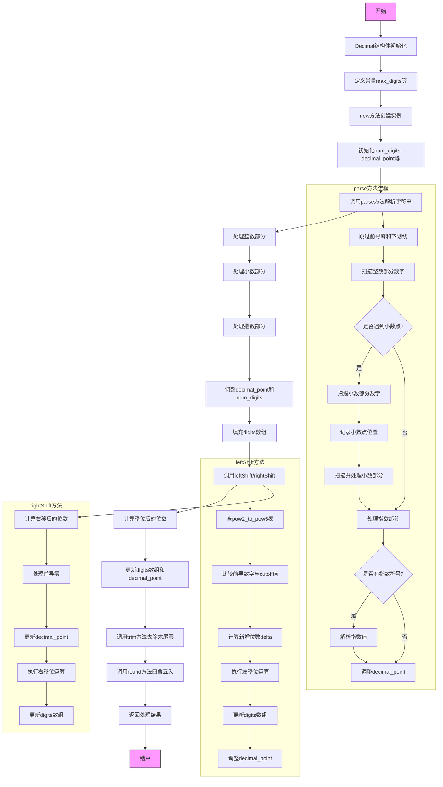

好的，我需要为提供的Zig代码中的`Decimal`函数绘制流程图。首先，我得理解这段代码的结构和各个部分的功能。

首先，`Decimal`是一个泛型函数，根据传入的类型`T`返回一个结构体。结构体内部包含处理十进制数的方法和属性。主要的方法有`new`、`tryAddDigit`、`trim`、`round`、`leftShift`、`rightShift`、`parse`和`numberOfDigitsLeftShift`等。

我需要从顶层结构开始分解。首先，`Decimal`函数根据`MantissaT`的类型（u64或u128）确定不同的常量值，如`max_digits`、`max_digits_without_overflow`等。接着定义结构体`Self`，包含字段如`num_digits`、`decimal_point`、`truncated`和`digits`数组。

接下来，各个方法的功能：

1. **new()**: 初始化结构体，设置默认值。
2. **tryAddDigit()**: 向`digits`数组添加数字，如果未超过最大长度。
3. **trim()**: 去除末尾的零。
4. **round()**: 对小数进行四舍五入处理，返回对应的MantissaT类型值。
5. **leftShift()**: 对十进制数进行左移位操作（乘以2^shift）。
6. **rightShift()**: 右移位操作（除以2^shift）。
7. **parse()**: 解析字符串为十进制数，处理整数、小数部分和指数。
8. **numberOfDigitsLeftShift()**: 计算左移后的十进制位数，使用预先生成的表来快速确定。

接下来，我需要确定流程图的起点和各个方法之间的调用关系。由于这是结构体的方法，每个方法可能在不同的上下文中被调用。例如，`parse`方法可能被外部调用来初始化结构体，而`leftShift`和`rightShift`可能在数值调整时使用。

在绘制流程图时，应分为几个主要部分：

1. **结构体初始化**：通过`new`方法创建实例。
2. **解析输入字符串**：`parse`方法处理字符串，提取数字、小数点和指数。
3. **调整数值**：通过`leftShift`和`rightShift`调整数值，涉及内部计算和位数调整。
4. **四舍五入处理**：`round`方法根据当前位置的数值决定进位。
5. **辅助方法**：如`trim`去除零，`tryAddDigit`添加数字。

需要注意各个方法之间的数据流动，例如`parse`填充`digits`数组后，可能调用`trim`来清理末尾零，或者在移位操作后调整`decimal_point`的值。

此外，`numberOfDigitsLeftShift`方法使用预先生成的表来确定移位后的位数，这部分需要展示查表过程和比较逻辑。

在绘制时，应使用不同的形状表示不同步骤，如开始/结束用椭圆，处理步骤用矩形，判断用菱形。例如，`parse`方法中处理小数点和指数的部分会有条件判断。

可能遇到的难点是正确表达循环和条件分支，尤其是在`leftShift`和`rightShift`中的循环处理数字的部分。需要确保流程图的每个步骤清晰，特别是移位操作中的位运算和进位处理。

最后，需要验证流程图的逻辑是否覆盖所有方法，并且正确反映了代码的执行流程，包括错误处理和边界条件，如`num_digits`超过最大值时的截断处理。
================================================
