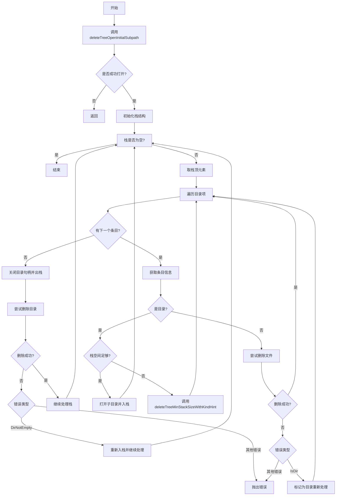

好的，我需要帮用户用Mermaid画出Zig语言中deleteTree函数的流程图。首先，我需要仔细阅读并理解这个函数的逻辑。这个函数的作用是递归删除目录树，处理各种可能的错误情况，并且在Windows系统上特别注意关闭目录句柄后再删除。

首先，函数开始时会调用deleteTreeOpenInitialSubpath来打开初始的子路径。如果返回nil，就直接返回。否则，初始化一个栈结构来管理目录遍历的上下文。栈中的每个元素包含目录名、父目录和迭代器。

接下来，函数进入一个循环处理栈中的每个目录项。对于每个目录项，使用迭代器遍历其中的文件和子目录。遇到子目录时，会尝试将其推入栈中继续处理；如果是文件，则直接删除。如果遇到目录无法立即删除（比如因为非空），会在关闭句柄后重新尝试删除。

在Windows系统上，删除目录前需要先关闭相关的句柄，因此代码中有相应的处理逻辑。此外，错误处理部分需要考虑各种可能的错误类型，比如访问被拒绝、文件未找到等，并做出相应的处理。

为了画流程图，我需要将这些步骤分解为不同的节点和判断条件。例如，初始打开子路径、栈的初始化、循环处理栈中的项、处理文件和目录的不同情况、错误处理分支等。同时，需要注意循环和条件分支的连接，比如处理目录时可能需要重新入栈或者调用其他删除方法。

可能需要注意的细节包括栈的管理（如入栈、出栈）、错误处理路径、以及特定于Windows的关闭句柄步骤。另外，代码中的一些循环和标签（如process_stack和handle_entry）需要正确映射到流程图的节点和箭头。

最后，确保流程图的结构清晰，能够反映函数的整体逻辑，包括递归删除目录树的过程，以及处理各种异常情况的路径。可能需要使用不同的形状表示开始/结束、处理步骤、判断条件等，并用箭头连接它们以表示流程方向。
================================================

该流程图描述了以下过程:
1. 初始化时尝试打开目标路径
2. 使用栈结构进行深度优先遍历
3. 处理文件和目录的不同删除逻辑
4. 处理Windows系统需要先关闭句柄的特殊情况
5. 错误处理流程和重试机制
6. 目录遍历完成后的清理工作
7. 整个过程的循环控制流

每个菱形节点表示条件判断，矩形节点表示操作步骤，箭头方向表示程序执行流向。对于关键的Windows特殊处理和错误重试机制进行了专门的分支处理。