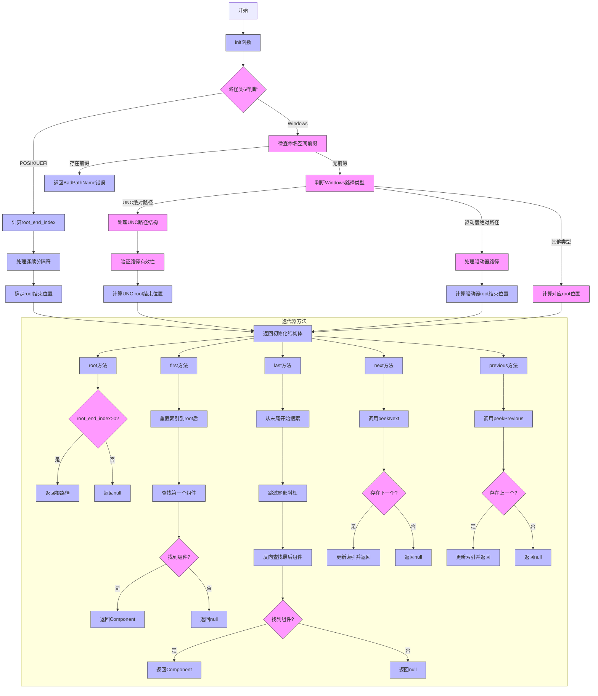

嗯，我需要为这个Zig函数画一个流程图。首先，我要理解这个函数的作用。看起来这是一个处理路径的组件迭代器，支持不同的路径类型，比如POSIX、Windows和UEFI。函数返回一个结构体，包含路径的处理逻辑，比如初始化、获取根目录、遍历前后的组件等。

首先，我应该分析主要的函数和方法。首先是`init`函数，它根据不同的路径类型初始化迭代器。然后是`root`方法，获取根路径。接着是`first`、`last`、`next`、`peekNext`、`previous`、`peekPrevious`这些方法，用于遍历路径的各个组件。

画流程图的话，可能需要从`init`开始，根据不同的路径类型处理根目录，然后进入循环或条件判断来处理各个组件。每个方法可能有不同的分支，比如处理POSIX和Windows路径的不同逻辑，或者在遍历时判断是否还有下一个或前一个组件。

不过，这个函数比较复杂，特别是`init`函数里有很多条件分支，比如处理Windows路径时的各种情况，比如UNC路径、驱动路径等。可能需要为每个路径类型画出不同的流程分支。此外，迭代器的状态更新，比如`start_index`和`end_index`的变化，也需要在流程图中体现出来。

可能会用到条件判断（菱形框）、处理步骤（矩形框）、循环等元素。另外，错误处理部分，比如返回`error.BadPathName`的情况，也需要在流程图中标注出来。

可能需要分几个部分来画：初始化部分、获取根目录、遍历前向组件、遍历后向组件等。每个部分内部的逻辑需要详细展开，确保覆盖所有可能的分支和情况。

不过，考虑到时间和复杂度，可能需要简化一些细节，只画出主要的流程路径，特别是公共接口的方法调用顺序和条件判断。这样可以让流程图更清晰，而不是陷入过多的实现细节中。

最后，需要确保流程图的逻辑正确，能够反映代码的实际执行流程，特别是不同路径类型的处理差异，以及迭代器状态的更新方式。
================================================

该流程图展示了以下关键路径：
1. 初始化过程根据不同的路径类型（POSIX/UEFI/Windows）采用不同计算逻辑
2. Windows路径的特殊处理流程（命名空间前缀检查、UNC路径验证等）
3. 迭代器核心方法（first/last/next/previous）的执行逻辑
4. 状态索引更新的核心机制
5. 错误处理路径（BadPathName返回）

各方法通过索引操作和路径分隔符判断实现双向遍历能力，不同路径系统的差异在初始化阶段集中处理，后续方法共享统一的遍历逻辑。