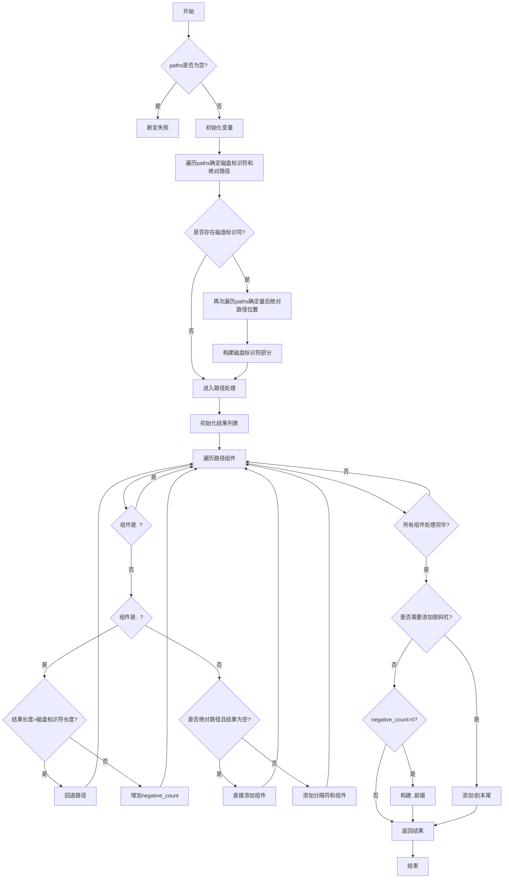

嗯，我现在需要给这个名为resolveWindows的Zig函数画流程图。首先，我得仔细读一遍代码，理解它的逻辑结构。这个函数的主要作用应该是解析Windows路径，处理不同路径的组合，生成最终的绝对路径。

首先，函数开始检查paths数组是否非空，然后初始化一些变量，比如result_drive_buf、disk_designator、drive_kind等。接下来，它遍历每个路径，解析每个路径的类型（比如驱动器、网络共享等），并确定是否有绝对路径。这里可能需要处理磁盘标识符和网络共享的不同情况。

然后，如果存在磁盘标识符（比如C:或网络路径），函数会再次遍历路径，找到最后一个绝对路径的位置，并统计相关路径的最大字节数。这部分逻辑可能有点复杂，需要处理不同磁盘标识符的情况，并且确定正确的起始索引。

接下来，函数分配内存空间，根据是否有绝对路径来构建磁盘标识符部分。对于驱动器类型，直接添加；对于网络共享，可能需要处理服务器名和其他名称，构建类似\\server\share的结构。

然后处理路径的各个组件，使用tokenize分割路径，处理.和..的情况。遇到..时，可能需要回退到上一级目录，这里需要处理边界情况，比如根目录下不能继续回退，或者处理负数计数的情况。

最后，根据处理后的结果，构建最终的路径字符串，处理可能的负数计数（比如多个..的情况），并返回最终的路径。

在画流程图时，需要将这些步骤分解为不同的流程块，包括初始检查、确定磁盘标识符、两次遍历路径、构建结果路径、处理组件、处理.和..、处理负数计数以及最终结果的组装等。每个条件判断（比如是否有绝对路径、磁盘类型是否为None等）都需要分支处理。

需要注意循环结构，比如for循环遍历paths数组，以及内部的while循环处理路径组件。另外，错误处理部分（比如内存分配是否成功）可能需要考虑，但代码中使用了try，所以可能由调用者处理错误。

可能还需要注意一些细节，比如磁盘标识符的比较（compareDiskDesignators函数），以及路径分隔符的处理（/和\\），这些在流程图中可能需要用条件分支表示。

最后，生成最终的路径字符串时，需要考虑多种情况，比如是否在根目录，是否需要添加尾部反斜杠，以及如何处理多个..的情况。这部分逻辑比较复杂，可能需要多个条件分支和循环结构。

总的来说，流程图应该从函数入口开始，按照逻辑顺序逐步展开每个步骤，处理各个条件判断和循环，最终生成结果路径。需要确保每个判断和循环都有正确的分支，并正确连接各个步骤。
================================================
