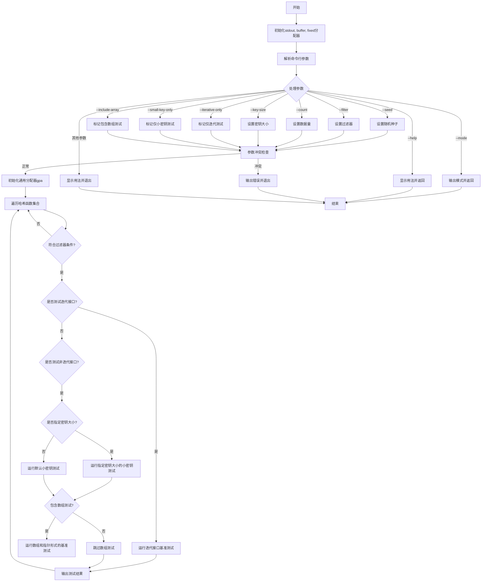

好的，我现在需要为这个Zig函数绘制一个流程图。首先，我需要理解这个函数的功能和结构。看起来这是一个基准测试的主函数，用于测试不同的哈希函数性能。函数首先处理命令行参数，然后根据参数配置运行不同的基准测试。

首先，函数开始处定义了一些变量，比如stdout、buffer、fixed分配器、args等。接着解析命令行参数，设置各种选项，比如filter、count、key_size、seed等。这里有很多条件判断，处理不同的参数，比如--mode、--seed、--filter等。需要理清每个参数的处理逻辑，特别是那些可能导致提前返回或退出的情况，比如参数不正确时调用usage()并退出。

接下来，函数进行一些参数之间的冲突检查，比如同时使用--iterative-only和--small-key-only会报错。然后初始化通用分配器gpa，并进入循环，遍历所有哈希函数（inline for (hashes) |H|）。对于每个哈希函数，根据filter决定是否执行测试。然后根据不同的测试选项（如test_iterative_only、test_small_key_only、test_arrays）来运行不同的基准测试，并输出结果。

流程图的绘制需要涵盖整个主函数的流程，包括参数解析、错误处理、基准测试的执行和结果输出。需要注意条件分支，比如各个命令行参数的处理，循环结构，以及可能的提前退出情况。此外，内联循环（inline for）处理每个哈希函数的不同测试情况，这部分也需要在流程图中体现，可能需要使用子流程或分支来表示不同的测试路径。

在绘制过程中，需要确保每个判断节点（如参数是否存在、条件是否满足）都有明确的分支，并且各个步骤之间的顺序正确。同时，错误处理和提前退出的情况也要标注清楚。最后，输出结果的部分需要展示不同测试情况下的输出格式和内容。
================================================
