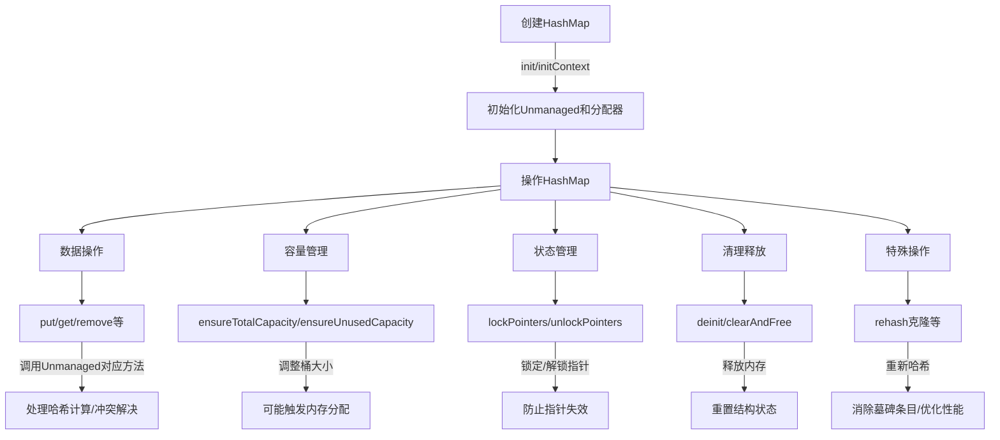

嗯，用户让我用Mermaid画出一个Zig函数的流程图，提供的代码是hash_map.zig中的HashMap函数。首先，我需要仔细理解这段代码的结构和功能。

首先，这个函数是一个泛型函数，返回一个结构体类型，作为HashMap的实现。结构体内部包含Unmanaged实例、分配器和上下文。看起来这个HashMap是对HashMapUnmanaged的一个封装，提供了内存管理的功能。

接下来，我需要确定流程图的范围。用户可能希望的是整个HashMap结构体的方法流程，或者仅仅是HashMap函数的创建流程。但根据问题描述，“画出函数的流程图”，可能指的是整个结构体的各个方法之间的调用流程，或者初始化、操作的过程。

不过，考虑到代码中的每个方法基本上都是调用Unmanaged对应的方法，可能流程图的重点在于HashMap如何封装Unmanaged，以及各个方法如何代理到Unmanaged的实现。例如，init、deinit、put、get等方法都是通过调用Unmanaged的相应方法来完成操作。

此外，需要注意一些特殊方法，如lockPointers、unlockPointers、rehash等，这些方法可能涉及到状态的变化或者内部结构的调整。例如，rehash会重新整理哈希表，清除墓碑条目，这会影响后续的操作流程。

可能的流程图结构可以分为几个部分：

1. 初始化：调用init或initContext创建HashMap实例，设置allocator和ctx。
2. 数据操作：如put、get、remove等，这些操作会通过Unmanaged的方法处理，可能涉及内存分配、哈希计算、冲突解决等步骤。
3. 容量管理：ensureTotalCapacity、ensureUnusedCapacity等方法调整哈希表的大小。
4. 状态管理：lock/unlock指针，防止在操作过程中指针失效。
5. 清理和释放：deinit、clearRetainingCapacity、clearAndFree等方法释放资源。

需要将每个主要方法的调用流程用Mermaid的流程图表示出来，可能需要考虑条件分支，例如在getOrPut时，如果键存在则返回现有条目，否则插入新条目。

不过，由于整个结构体有很多方法，全部画出来可能会非常复杂。因此，可能需要选择主要的方法和关键流程来简化图表。例如，初始化、插入数据、获取数据、扩容、释放这几个主要步骤，并展示它们之间的关系。

另外，注意错误处理，例如Allocator.Error的处理在ensureTotalCapacity等方法中的流程是否需要体现在图中。或者可能用户只需要高层次的流程，而不需要深入到错误处理的分支。

最终，可能需要将整个HashMap结构体的生命周期和主要操作流程用Mermaid的流程图形式呈现，展示各个方法之间的调用关系和顺序。
================================================

该流程图展示了：
1. 初始化阶段创建基础结构
2. 核心数据操作流程
3. 容量调整机制
4. 指针安全控制
5. 资源释放过程
6. 性能优化操作
各环节通过调用底层Unmanaged实现具体功能，形成完整的哈希表生命周期管理。