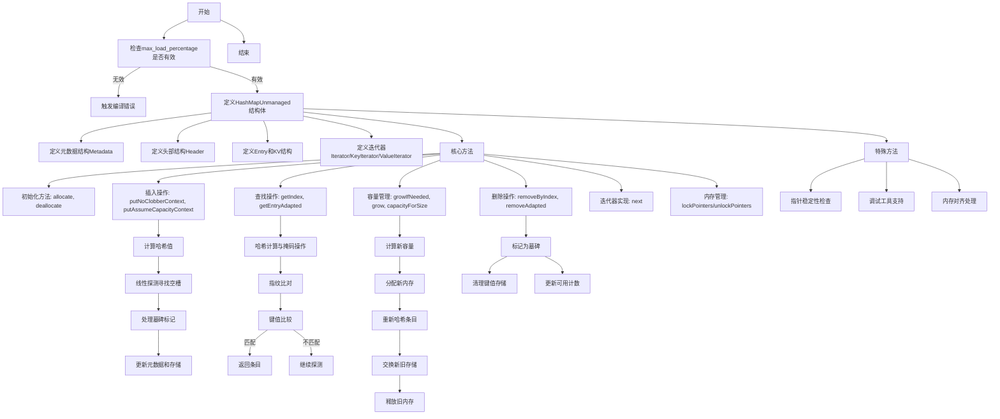

好的，我需要为这个Zig语言的HashMapUnmanaged函数绘制流程图。首先，我需要理解这个函数的结构和各个部分的功能。函数定义了一个泛型的HashMapUnmanaged类型，包含初始化、容量管理、插入、删除、查找等操作。

首先，流程图应该从函数入口开始，即pub fn HashMapUnmanaged(...) type。接下来，函数检查max_load_percentage是否在0到100之间，否则触发编译错误。然后返回一个结构体，这个结构体包含了哈希表的各种方法和属性。

接下来，结构体内部有Metadata、Header、Entry等子结构定义。流程图中需要展示这些子结构的交互，比如Metadata用于跟踪槽位的状态（空、使用中、墓碑），Header管理容量和存储的键值对数组。

然后，考虑主要的操作流程，比如put、get、remove等。例如，插入操作（putNoClobberContext）需要检查容量，必要时扩容，然后找到合适的槽位插入键值对。查找操作（getIndex）需要根据哈希值找到索引，处理冲突，直到找到匹配的键或空槽。

扩容流程（grow函数）需要分配新内存，重新哈希所有现有条目到新数组中，并释放旧内存。删除操作（removeByIndex）需要标记槽位为墓碑，并调整可用空间。

需要注意各个函数之间的调用关系，比如ensureTotalCapacityContext可能触发growIfNeeded，进而调用grow。同时，错误处理（如内存分配失败）也需要在流程图中体现。

最后，流程图应涵盖从初始化到销毁的整个生命周期，包括内存分配和释放（allocate和deallocate函数）。

在绘制过程中，可能需要将复杂的函数分解为多个步骤，使用分支和循环结构来表示条件判断和循环处理，例如在查找索引时的循环探测。同时，各部分的并发控制和状态管理（如pointer_stability）也需要适当表示。

需要确保流程图的逻辑清晰，步骤连贯，覆盖所有主要功能点，并正确反映代码的执行流程。
================================================

该流程图展示了以下核心逻辑：
1. 类型初始化时的有效性检查
2. 核心数据结构定义（Metadata/Header/Entry）
3. 关键操作流程（插入/查找/删除）
4. 动态扩容机制
5. 内存管理策略
6. 并发安全控制
7. 调试和工具支持

箭头方向表示程序执行流程，菱形框表示条件判断，矩形框表示操作步骤，子流程通过嵌套方式展示。每个核心方法都分解为具体的实现步骤，并保持与原始Zig代码的对应关系。