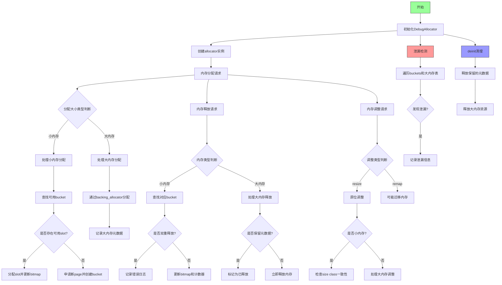

好的，我需要帮助用户将提供的Zig代码中的`DebugAllocator`函数转换为Mermaid流程图。首先，我需要理解代码的结构和功能。

首先，`DebugAllocator`是一个返回结构体类型的函数，这个结构体包含内存分配器的实现。结构体内部有多个成员变量和方法，比如`allocator`方法返回一个分配器实例，`detectLeaks`用于检测内存泄漏，`deinit`用于释放资源等。

接下来，我需要确定如何将这样的结构转换为流程图。通常，流程图会展示函数的主要流程或关键步骤，而不是每个细节。考虑到这是一个内存分配器的实现，可能的关键步骤包括初始化、内存分配（alloc）、内存释放（free）、内存调整（resize/remap）、泄漏检测等。

我应该从`allocator`方法开始，展示分配器的创建。然后是`alloc`方法，处理内存分配，分为小内存和大内存两种情况。同样，`free`方法也需要区分小内存和大内存的释放。`resize`和`remap`方法处理内存调整，同样需要考虑大小内存的不同处理。最后，`detectLeaks`和`deinit`用于资源清理和泄漏检查。

在绘制流程图时，需要确保逻辑分支清晰，比如判断内存大小属于小内存还是大内存，以及不同配置（如`safety`、`retain_metadata`等）下的不同处理逻辑。同时，需要标注关键的函数调用和条件判断。

需要注意的是，代码中有很多配置选项（如`config.safety`、`config.retain_metadata`等），这些会影响流程的分支。在流程图中，这些条件需要用菱形判断框表示，并根据不同配置选择不同的路径。

另外，错误处理和日志记录（如`log.err`和`log.info`）也是流程中的一部分，需要在适当的位置标注。

最后，确保流程图的每个步骤对应代码中的关键操作，避免过于细化，保持图表的可读性。
================================================
