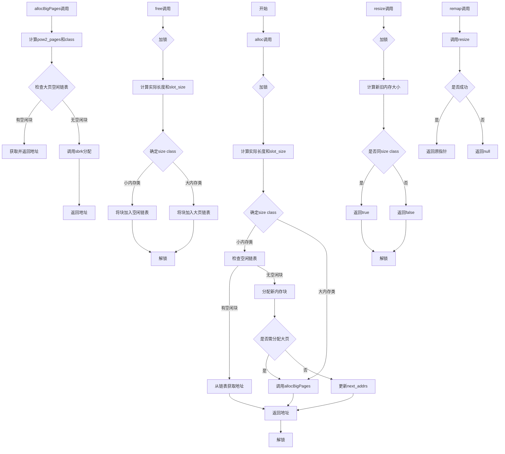

好的，我现在需要帮助用户理解他们提供的Zig代码中的SbrkAllocator函数，并用Mermaid画出流程图。首先，我得仔细阅读这段代码，了解它的结构和功能。

首先，这个函数SbrkAllocator接受一个sbrk函数指针作为参数，返回一个结构体类型。结构体内部定义了内存分配器的vtable，包括alloc、resize、remap、free等方法。还有一些常量和变量，比如size_class_count、next_addrs、frees、big_frees等，用于管理不同大小的内存块。

接下来，我需要理清每个方法的作用和流程。比如alloc函数负责分配内存，它会根据请求的大小确定内存类别，检查是否有空闲块，如果没有则通过sbrk申请新的内存。resize函数检查是否可以调整内存大小而不移动数据，free函数将内存块释放回相应的空闲链表。

流程图需要涵盖主要的函数调用流程，特别是alloc、free、allocBigPages这几个核心部分。可能需要分步骤绘制每个函数的决策流程，比如判断是否有空闲内存、是否需要扩展堆等。

需要注意的是，代码中有线程锁的使用，确保多线程安全，这在流程图中可能需要体现。但Mermaid流程图主要关注控制流，可能不需要详细显示锁机制，除非用户特别要求。

另外，代码中的一些数学计算，如计算内存块大小类别、页数等，可能需要转化为流程中的判断条件。例如，alloc中根据size_class选择不同的分配路径，bigPagesNeeded计算需要的大页数量等。

现在，我需要将这些逻辑步骤转化为Mermaid的流程图语法。可能需要为每个主要函数（alloc、free、resize、allocBigPages）创建子图，展示它们内部的判断和操作流程。

例如，alloc函数的流程大致如下：
1. 加锁
2. 计算实际需要的内存大小和对应的size class
3. 检查该class的空闲链表是否有可用块
4. 有则从空闲链表取，否则分配新的内存块（可能调用allocBigPages）
5. 解锁并返回地址

allocBigPages的流程：
1. 计算需要的大页数量
2. 检查对应class的空闲链表
3. 有则取用，否则调用sbrk分配新内存

free函数的流程：
1. 加锁
2. 计算内存块的大小和class
3. 将内存块加入对应class的空闲链表
4. 解锁

需要将这些步骤用Mermaid的节点和箭头连接起来，注意条件判断的分支。

可能还需要处理错误情况，比如内存不足时返回null，这在流程图中应有所体现。

总结，整个流程图将涵盖各个主要函数的执行步骤，条件分支，以及它们之间的调用关系。确保流程图的逻辑清晰，步骤正确，与代码逻辑一致。
================================================
