嗯，我需要为这个Zig语言编写的`feed`函数画一个流程图。首先，我得理解这个函数的结构和逻辑。这个函数看起来是处理HTTP头部解析的，状态机模式，根据不同的状态处理输入的字节流。

首先，函数`feed`的参数是一个`HeadParser`指针和一个字节切片，返回处理过的字节数。主循环是一个无限循环，根据当前状态进行不同的处理。状态包括`.start`、`.seen_n`、`.seen_r`、`.seen_rn`、`.seen_rnr`和`.finished`。

接下来，我得理清每个状态下的处理逻辑。例如，在`.start`状态下，根据剩余字节数有不同的分支：0、1、2、3、4到vector_len-1，以及其他情况。每个分支可能改变状态，并返回处理的索引或继续循环。

另外，在处理不同字节数时，函数会检查特定的字符序列，如`\r\n`、`\n\n`等，来转换状态或结束解析。比如，当检测到`\r\n\r\n`时，状态变为`.finished`，表示头部解析完成。

还有使用SIMD向量化处理的部分，当字节数足够多时，会使用向量运算来加速字符匹配，比如检测`\r`或`\n`的出现。

需要注意的是，每个case处理完可能更新`index`并继续循环，或者直接返回。状态转换的条件和返回值的计算需要准确反映在流程图中。

可能遇到的困难是如何将复杂的条件分支和状态转换可视化，特别是处理不同字节长度和向量化处理的部分。需要确保每个状态转换的条件清晰，并且流程图的路径正确无误。

最后，流程图应该从函数入口开始，按状态分支展开，展示每个状态下的处理逻辑和状态转换，直到返回最终的索引值。
================================================

```mermaid
graph TD
    A[开始feed函数] --> B{检查p.state}
    B -->|state是finished| C[返回index]
    B -->|state是start| D{检查剩余字节长度}
    
    D -->|长度0| C
    D -->|长度1| E[处理单个字节]
    E --> F{字节是\r或\n?}
    F -->|是| G[更新state到seen_r或seen_n]
    F -->|否| H[保持state]
    H --> I[返回index+1]
    
    D -->|长度2| J[处理两个字节]
    J --> K{检查\r\n或\n\n}
    K -->|匹配| L[更新state到seen_rn或finished]
    K -->|不匹配| M[检查单个字符]
    M -->|更新state| N[返回index+2]
    
    D -->|长度3| O[处理三个字节]
    O --> P{检查\r\n\r或其他}
    P -->|匹配| Q[更新state到seen_rnr]
    P -->|不匹配| R[检查单个或双字符]
    R --> S[返回index+3]
    
    D -->|长度4到vector_len-1| T[处理四字节块]
    T --> U{检查\r\n\r\n等}
    U -->|匹配| V[更新state到finished]
    U -->|不匹配| W[继续处理]
    W --> X[index增加4并继续循环]
    
    D -->|其他长度| Y[使用SIMD向量处理]
    Y --> Z{检测\r或\n数量}
    Z -->|数量0| AA[无状态变化]
    Z -->|数量1| AB[根据最后一个字符更新state]
    Z -->|数量2| AC[检查双字符组合]
    Z -->|数量3| AD[检查三字符组合]
    Z -->|数量4+| AE[遍历检查特殊序列]
    AE --> AF[找到则结束并返回]
    AE --> AG[未找到则继续]
    AG --> AH[index增加vector_len并继续]
    
    B -->|state是seen_n| AI{处理seen_n状态}
    AI -->|长度0| C
    AI -->|其他| AJ[检查下一个字符]
    AJ -->|是\n| AK[state转finished]
    AJ -->|否| AL[state转start]
    AL --> AM[index+1继续循环]
    
    B -->|state是seen_r| AN{处理seen_r状态}
    AN -->|长度0| C
    AN -->|长度1| AO[检查字符]
    AO -->|是\n| AP[state转seen_rn]
    AO -->|是\r| AQ[保持seen_r]
    AO -->|其他| AR[state转start]
    AR --> AS[返回index+1]
    
    AN -->|长度2| AT[处理两个字节]
    AT --> AU{检查\r\n等组合}
    AU -->|匹配| AV[更新state]
    AU -->|不匹配| AW[返回index+2]
    
    AN -->|其他长度| AX[处理三个字节]
    AX --> AY[检查可能组合]
    AY --> AZ[index+3继续循环]
    
    B -->|state是seen_rn| BA{处理seen_rn状态}
    BA -->|长度0| C
    BA -->|长度1| BB[检查字符]
    BB -->|是\r| BC[state转seen_rnr]
    BB -->|是\n| BD[state转seen_n]
    BB -->|其他| BE[state转start]
    BE --> BF[返回index+1]
    
    BA -->|其他长度| BG[处理两个字节]
    BG --> BH{检查\r\n或\n\n}
    BH -->|匹配| BI[state转finished]
    BH -->|不匹配| BJ[index+2继续循环]
    
    B -->|state是seen_rnr| BK{处理seen_rnr状态}
    BK -->|长度0| C
    BK -->|其他| BL[检查字符]
    BL -->|是\n| BM[state转finished]
    BL -->|否| BN[state转start]
    BN --> BO[index+1继续循环]
``` 

该流程图按以下逻辑组织：
1. 函数入口根据当前解析器状态进行分支
2. 每个状态根据可用字节长度进行不同处理
3. 使用菱形节点表示条件判断
4. 矩形节点表示状态更新和索引操作
5. 箭头方向表示程序流程走向
6. 特别处理了SIMD向量优化路径
7. 最终都会收敛到返回index或继续循环处理