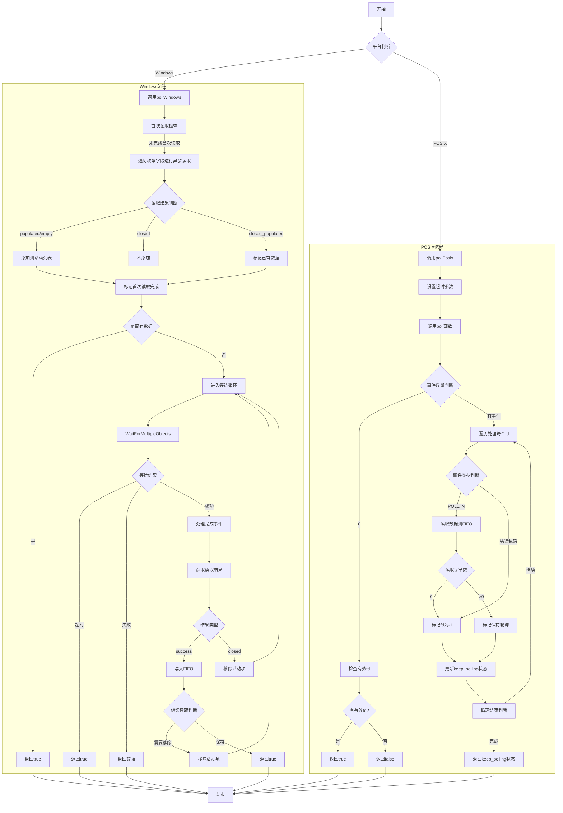

好的，我需要为这个Zig编写的Poller函数绘制流程图。首先，我应该理解这个函数的结构和功能。看起来这是一个跨平台的轮询器，支持Windows和POSIX系统。结构体Poller有两个主要的poll方法：pollWindows和pollPosix，分别处理不同平台的轮询逻辑。

首先，我需要确定流程图的范围。用户希望画出函数的流程图，这里可能指的是整个Poller结构体的方法流程，特别是poll和pollTimeout这两个公共方法，以及它们调用的pollWindows和pollPosix。

接下来，我需要分析每个方法的主要步骤。例如，pollWindows方法处理Windows平台的异步I/O，包括初始读取、等待多个对象、处理完成事件等。而pollPosix则使用POSIX的poll函数来处理文件描述符的状态变化。

在绘制流程图时，应该从公共方法poll和pollTimeout开始，根据平台选择进入pollWindows或pollPosix。然后分别展开这两个方法的内部逻辑。对于pollWindows，需要处理第一次读取、等待事件、处理完成事件、更新缓冲区等步骤。对于pollPosix，则是设置poll参数、调用poll函数、处理每个文件描述符的事件、更新FIFO队列等。

需要注意的是条件判断和循环结构，比如在pollWindows中的while循环，以及在pollPosix中的inline for循环。这些结构应该在流程图中明确表示出来。此外，错误处理和超时处理也是重要的分支点，需要在流程图中体现。

最后，要确保流程图的层次清晰，每个步骤之间有正确的箭头指向，条件判断有分支路径，并且各个子过程如windowsAsyncReadToFifoAndQueueSmallRead和windowsGetReadResult也适当简化表示，避免过于复杂。

可能需要多次检查代码逻辑，确保流程图准确反映了函数的执行流程，特别是平台相关的差异和异步处理的不同步骤。
================================================
