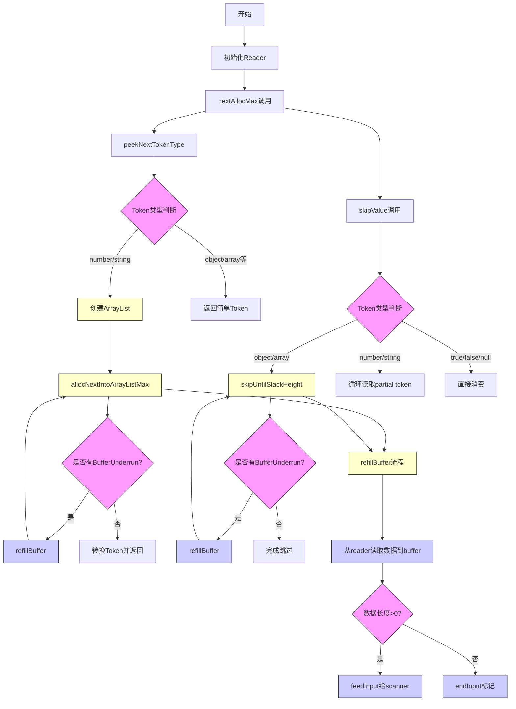

嗯，用户让我用Mermaid画出一个Zig函数的流程图。首先，我需要仔细看一下提供的代码，理解它的结构和逻辑。这个代码定义了一个Reader结构体，包含了一些方法，比如init、deinit、nextAlloc、skipValue等等。主要的逻辑似乎围绕着JSON的解析和处理缓冲区数据。

首先，我应该确定流程图的范围。用户提到的是整个函数，但可能是指整个Reader结构体的方法流程。不过，每个方法可能有不同的流程，特别是像nextAllocMax、skipValue、refillBuffer这些关键方法。需要判断是否需要为每个方法单独画流程图，还是综合整个结构体的工作流程。

接下来，我需要理清各个方法之间的调用关系。例如，nextAllocMax调用了peekNextTokenType、allocNextIntoArrayListMax，而allocNextIntoArrayListMax又可能调用refillBuffer。refillBuffer负责填充缓冲区，可能会被多个方法调用，比如在遇到BufferUnderrun错误时。

然后，考虑流程图的起点。通常，初始化（init）可能是起点，但用户可能更关注数据处理的流程，比如从读取数据到解析令牌的过程。可能应该以next或nextAlloc作为主要流程的起点，因为这些是主动触发解析的方法。

对于每个方法，需要分解其步骤。例如，nextAllocMax首先获取下一个令牌类型，然后根据类型处理数值或字符串，可能分配内存或使用现有缓冲区。处理过程中如果缓冲区不足，会调用refillBuffer来填充数据，然后继续处理。

需要注意错误处理，特别是BufferUnderrun的情况，这时候会重新填充缓冲区并重试。这部分在流程图中需要有循环结构表示。

可能还需要考虑条件分支，比如不同的令牌类型（number、string、object_begin等）会导致不同的处理路径。这些分支在流程图中需要用菱形判断框表示。

另外，像skipValue方法需要处理不同的令牌类型，跳过整个对象或数组结构，可能需要递归或循环跳过嵌套结构。这部分流程也需要在图中体现。

最后，整合所有主要方法和它们之间的交互，形成一个完整的流程图。可能需要分块表示不同的方法，然后用箭头连接它们之间的调用和返回关系。同时，确保错误处理路径和循环结构正确表示。

总结来说，流程图的绘制需要涵盖以下几个主要部分：
1. 初始化Reader。
2. 读取和解析令牌的主要流程（next、nextAllocMax）。
3. 处理缓冲区不足时的重填逻辑（refillBuffer）。
4. 跳过值的逻辑（skipValue）。
5. 错误处理路径。

需要确保每个步骤之间的转换清晰，并且循环和条件分支正确呈现。可能需要使用子流程或分页来避免图表过于复杂，但根据用户要求，可能需要在一个图中综合展示。
================================================
