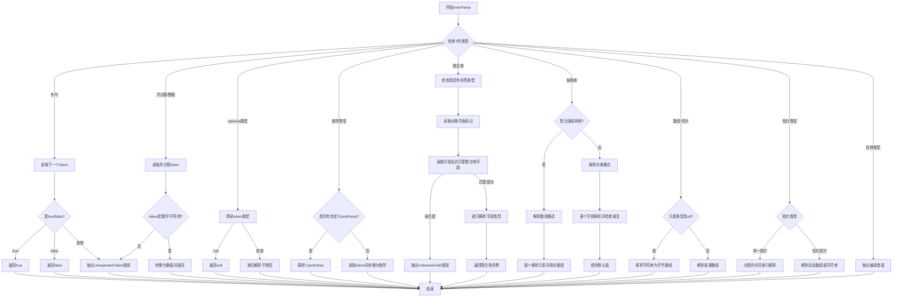

嗯，我需要为这个Zig函数`innerParse`画一个流程图。首先，我得仔细看看这个函数的结构。函数里有一个大的`switch`语句，根据类型`T`的类型信息进行不同的处理。每种类型都有不同的处理逻辑，比如布尔、浮点数、整数、枚举、联合体、结构体等等。

首先，我应该先理清每个`case`分支的逻辑。例如，当`T`是布尔类型时，直接根据下一个token返回true或false。对于浮点数和整数，会读取token并尝试转换为相应的数值类型。可选类型（optional）需要处理可能的null值。枚举类型可能需要调用自定义的解析函数，或者将字符串或数字转换为枚举值。联合体（union）需要处理对象结构，并解析对应的字段。结构体（struct）则分为元组结构体和普通结构体，分别处理数组和对象的情况。数组和指针类型也有不同的处理方式，特别是动态数组和固定长度的数组。

接下来，我需要将这些逻辑转换成流程图中的各个节点和判断条件。每个`case`分支对应一个处理流程，可能需要不同的判断步骤。例如，处理结构体时，需要检查是否是元组结构体，然后分别处理数组或对象的情况，同时处理字段的重复和未知字段的情况。

需要注意的是，函数中有递归调用`innerParse`的情况，例如在处理可选类型或结构体字段时。这时候流程图可能需要表示出递归的流程。不过，在流程图中直接表示递归可能会比较复杂，可以考虑用子流程或者标注来表示递归调用。

另外，错误处理也是关键。每个分支都可能抛出不同的错误，比如`UnexpectedToken`、`UnknownField`等，这些需要在流程图中体现出来。比如，在处理浮点数时，如果token不是数字或字符串，就会返回错误。

可能还需要考虑内存管理，比如使用`allocator`分配和释放内存的部分，但流程图可能更关注逻辑流程而不是内存管理的细节。

总的来说，绘制这个流程图需要将每个类型分支转化为相应的处理步骤，包括读取token、解析值、处理递归、错误检查等。同时，要注意各分支之间的相互关系，比如结构体处理中循环处理字段，直到遇到对象结束标记。

最后，使用Mermaid的语法将这些步骤和判断条件组织成流程图，确保逻辑清晰，步骤连贯。
================================================
