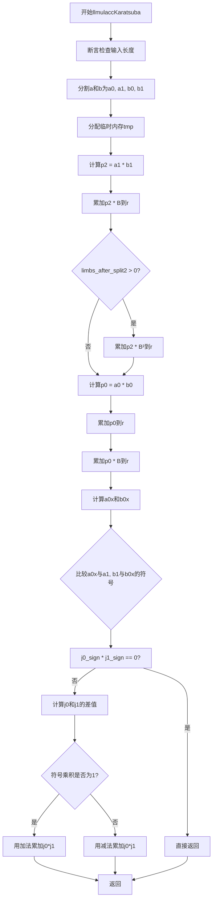

好的，我现在需要为给定的Zig函数`llmulaccKaratsuba`绘制一个流程图。首先，我需要理解这个函数的功能和结构。这个函数实现了Karatsuba算法来进行大整数的乘法，并累加到结果中。它处理了内存分配、中间结果的存储以及各种情况的处理，比如正负号的影响。

首先，我应该通读代码，了解各个部分的作用。函数开始于一些断言，确保输入的长度符合要求。接着，根据Karatsuba算法，将输入a和b分成高位和低位部分，即a1、a0和b1、b0。然后计算三个乘积p0、p1、p2，并根据这些结果来组合最终的乘积。

接下来，函数分配临时内存来存储中间结果。计算p2（a1*b1）并累加到结果r的适当位置。然后计算p0（a0*b0）并进行同样的累加。之后处理p1，这里需要处理符号的问题，因为p1可能涉及减法，所以需要根据符号来决定是加还是减。

在处理p1时，函数比较了a0和a1以及b1和b0的大小，确定它们的符号，然后进行相应的减法操作得到j0和j1。根据j0和j1的符号，决定是直接乘积累加还是取反后累减。

我需要将这些步骤转化为流程图中的各个节点。流程图的开始是函数入口，然后是检查输入长度是否符合条件。接着是分割a和b为高位和低位部分，计算p2、p0、p1。每个计算步骤都需要考虑结果的长度限制，以及如何累加到结果数组r中。

需要注意的是，流程图中应该包括条件判断，比如处理p1时符号不同的情况，这时候需要选择不同的操作（加或减）。此外，内存的分配和释放也是一个步骤，虽然可能不需要在流程图中详细画出，但可以作为步骤之一。

可能遇到的难点是正确表示各个步骤之间的依赖关系和条件分支。比如，当j0_sign * j1_sign为0时，直接返回；否则继续处理p1的计算。此外，计算p1时根据符号的正负决定是加还是减，这也需要条件分支。

另外，需要确保流程图的步骤顺序正确，例如先处理p2，然后是p0，最后是p1。每个步骤中的子步骤也需要明确，比如计算p2时使用llmulacc函数，然后累加到r的相应位置。

最后，流程图应该以函数结束作为终点，可能包括释放临时内存（虽然代码中是defer，可能在流程图中不显式表示）。

现在，我需要将上述思考整理成一个结构化的流程图，使用mermaid语法表示。确保每个步骤和条件都正确对应代码中的逻辑。
================================================

该流程图展示了：
1. 输入验证和变量分割阶段
2. 核心乘积计算(p2/p0/p1)的并行路径
3. 符号处理的条件分支
4. 中间结果的累加操作
5. 内存管理的隐式处理（通过defer自动释放）

关键决策点用菱形表示，主要计算步骤用矩形，箭头表示执行顺序。实际实现中需要注意：
- 所有累加操作都需要处理进位传播
- 临时内存的生命周期管理
- 大整数运算的边界条件处理