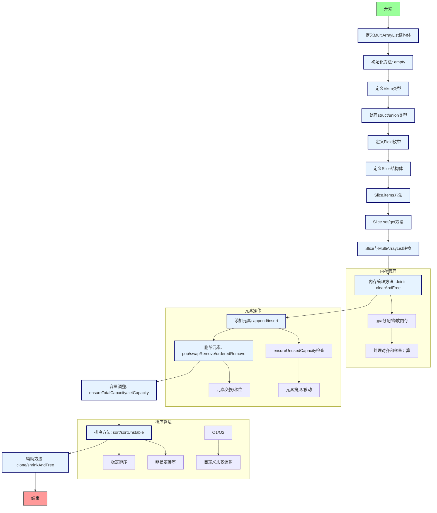

嗯，我现在需要帮用户把Zig语言中的MultiArrayList函数用Mermaid画出流程图。首先，我得先理解这个MultiArrayList的结构和功能。看起来这是一个泛型结构体，支持结构体和带标签的联合体。它内部管理一个字节数组，以及长度和容量。

首先，我需要确定流程图的范围。整个函数返回一个类型，所以流程图应该覆盖这个类型的主要方法和流程。比如初始化、添加元素、删除元素、扩容等操作。

然后，每个方法的具体流程需要分析。比如append方法会调用ensureUnusedCapacity来确保有足够的空间，然后添加元素。类似地，deinit方法会释放内存。可能还需要考虑slice方法如何生成各个字段的指针数组。

接下来，我需要将各个功能模块化，确定它们之间的关系。比如构造、析构、增删改查、排序等部分。每个部分内部的具体步骤需要拆解，比如扩容时的内存分配和复制过程。

需要注意的是，Zig中的内存管理需要手动处理，所以在流程图中要体现出分配和释放内存的步骤。此外，错误处理部分，比如ensureTotalCapacity可能会返回错误，也需要在流程图中体现。

可能还需要处理条件分支，比如在shrinkAndFree函数中，如果new_len为0，则调用clearAndFree，否则进行内存调整。这些条件判断需要在流程图中用菱形框表示。

另外，排序部分涉及到稳定排序和非稳定排序，可能需要不同的流程分支。不过这部分可能比较复杂，需要简化处理。

最后，将所有步骤用Mermaid的语法连接起来，确保逻辑清晰，步骤连贯。可能需要多次调整结构，确保每个函数的流程正确无误，并且没有遗漏重要的步骤。

在绘制过程中，可能会遇到一些不确定的地方，比如某些方法的具体实现细节是否需要详细展开，或者是否需要合并某些步骤以提高可读性。这时候需要根据用户的需求和流程图的目的来权衡，保持流程图的简洁性和准确性。
================================================
