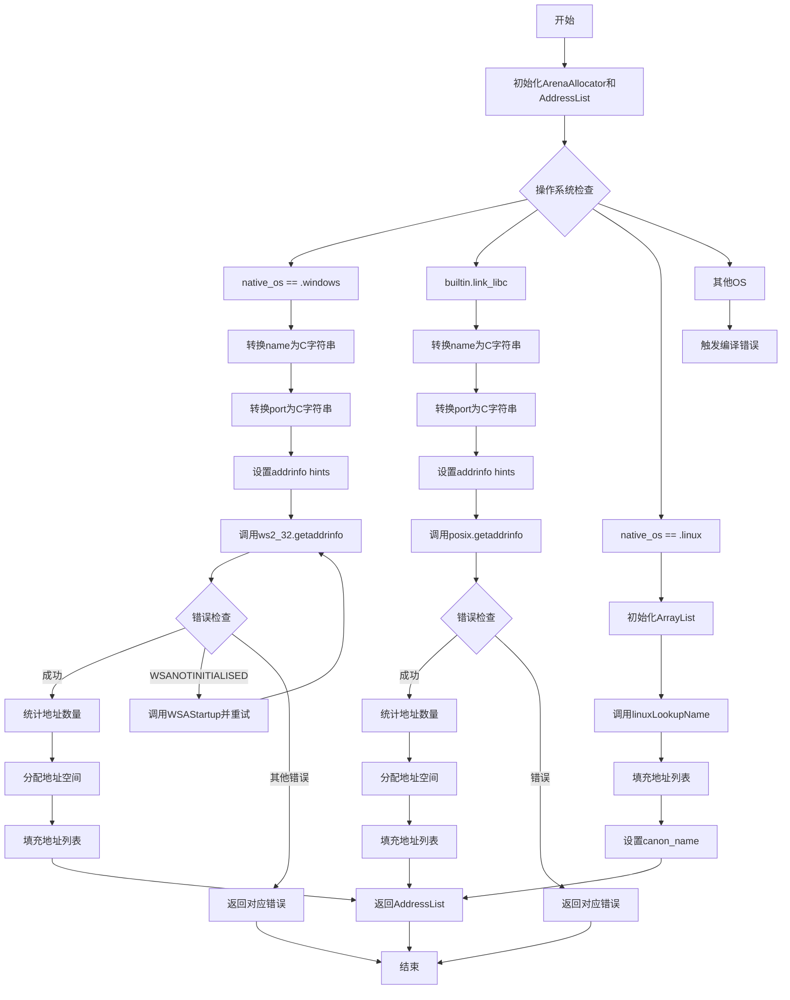

嗯，用户让我用Mermaid画一个Zig函数的流程图。首先，我需要理解这个函数的结构和逻辑。这个函数是`getAddressList`，看起来是用来获取地址列表的，可能和网络相关，比如解析主机名和端口。

首先，函数开始部分有一个`blk`块，初始化了一个`ArenaAllocator`，然后创建了一个`AddressList`结构体，并设置了一些初始值。这部分应该对应流程图的开始节点，比如“初始化ArenaAllocator”和“创建AddressList实例”。

接下来，函数根据不同的操作系统分支处理。这里有三个主要分支：Windows、使用libc的系统（比如Linux），以及原生的Linux处理。每个分支的处理逻辑不同，需要分别考虑。

对于Windows部分，函数处理了`getaddrinfo`的调用，处理可能的错误，然后遍历结果填充地址列表。这里可能会有循环和错误处理节点，比如“调用getaddrinfo”和错误判断，例如“WSATRY_AGAIN”返回错误等。

然后是使用libc的情况，类似Windows的处理，但调用了posix的`getaddrinfo`，同样需要处理错误码，并填充地址列表。这部分的结构和Windows类似，但错误码不同，需要对应的判断。

对于原生Linux的情况，函数调用了`linuxLookupName`，然后处理结果填充到`AddressList`中。这里可能有不同的步骤，比如初始化ArrayList，调用特定函数，处理结果等。

整个函数中，还有错误处理的部分，比如`errdefer`，这在流程图中可能需要表示为错误处理分支，或者在失败时跳转到清理步骤。

需要注意到函数在最后有一个`@compileError`，如果操作系统不支持，会编译错误。这可能在流程图中作为结束节点，或者条件判断后的一个终止节点。

可能的结构是：

1. 开始：初始化Arena和AddressList
2. 判断操作系统：
   - Windows分支
   - libc分支
   - Linux分支
   - 其他OS错误
3. 每个分支内部处理各自的逻辑，包括调用系统API，处理错误，填充地址列表
4. 返回结果或错误

需要注意循环结构，比如在Windows部分，有一个`while (true)`循环处理`getaddrinfo`，可能需要用循环节点表示。

在Mermaid中，流程图的节点用矩形，判断用菱形，箭头表示流程方向。可能的结构如下：

开始 -> 初始化Arena和AddressList -> 判断OS
如果是Windows -> 处理Windows的getaddrinfo -> 处理结果 -> 填充地址 -> 返回
如果是libc -> 处理posix的getaddrinfo -> 处理结果 -> 填充地址 -> 返回
如果是Linux -> 调用linuxLookupName -> 处理结果 -> 填充地址 -> 返回
其他OS -> 编译错误

同时，每个分支中的错误处理需要添加相应的错误节点，比如遇到错误时返回对应的错误码。

可能还需要处理内存分配失败的情况，比如`try allocator.dupeZ`可能会失败，需要错误处理分支。

需要详细阅读代码，确定每个步骤的条件和可能的路径，确保流程图覆盖所有主要流程和错误处理。
================================================
