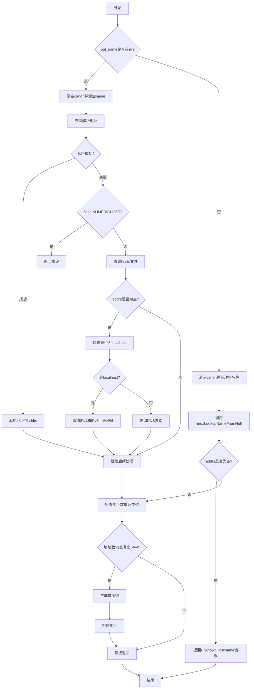

好的，我需要为给定的Zig函数`linuxLookupName`绘制流程图。首先，我需要仔细阅读并理解这个函数的逻辑。

函数的主要功能似乎是处理Linux下的名称解析，可能涉及主机名到地址的转换。函数参数包括地址列表、规范名称、可选名称、地址族、标志和端口。函数可能首先尝试解析提供的名称，如果失败，则检查是否为本地主机，或者查询DNS。

首先，函数检查`opt_name`是否存在。如果存在，则处理该名称，尝试解析为地址。如果解析失败且设置了`NUMERICHOST`标志，返回错误；否则，尝试从hosts文件查找，如果仍然没有结果，检查是否是`localhost`，并添加回环地址。如果还是没有结果，尝试DNS搜索。

如果没有提供名称，则调用`linuxLookupNameFromNull`来处理。

接下来，如果地址列表为空，返回错误。否则，根据地址类型（IPv4或IPv6）进行排序，特别是IPv6地址根据RFC 3484/6724的规则生成排序键，进行排序。

现在需要将这些步骤转化为流程图。流程图的节点包括判断条件、处理步骤和循环结构。可能的节点包括：

1. 开始
2. 检查opt_name是否存在
3. 处理存在的名称（解析地址，检查hosts文件，处理localhost，DNS查询）
4. 处理不存在的名称（调用linuxLookupNameFromNull）
5. 检查地址列表是否为空
6. 地址排序逻辑（生成排序键，排序）
7. 结束

需要注意条件分支，例如名称解析成功与否，是否有地址结果，地址类型判断等。此外，地址排序部分涉及循环遍历地址列表，生成每个地址的排序键，最后进行排序。

可能的分支点包括：
- opt_name是否为空
- 地址解析是否成功
- hosts文件查询是否有结果
- 是否为localhost
- 地址列表是否为空
- 地址类型是否全为IPv4
- 是否需要排序

在绘制流程图时，需要将这些条件用菱形判断框表示，处理步骤用矩形框，箭头表示流程方向。循环处理地址生成排序键的部分可以用循环结构表示。

需要确保所有可能的路径都被覆盖，例如处理名称时的不同情况，以及最后的排序逻辑是否执行的条件。此外，错误处理（如返回错误）也需要在流程图中体现。

最后，根据以上分析，使用Mermaid语法构建流程图，确保结构清晰，逻辑正确。
================================================

这个流程图展示了`linuxLookupName`函数的主要逻辑路径：
1. 根据`opt_name`存在与否分为两条主线
2. 名称解析失败时的fallback机制（hosts文件→localhost检查→DNS搜索）
3. 空名称的特殊处理
4. 结果集的验证（空结果报错）
5. 多地址结果的排序条件判断和执行
6. 最终返回路径的收敛

流程图中菱形节点表示条件判断，矩形节点表示操作步骤，箭头方向表示程序执行流向。关键排序逻辑仅在满足多地址且包含非IPv4地址时触发。