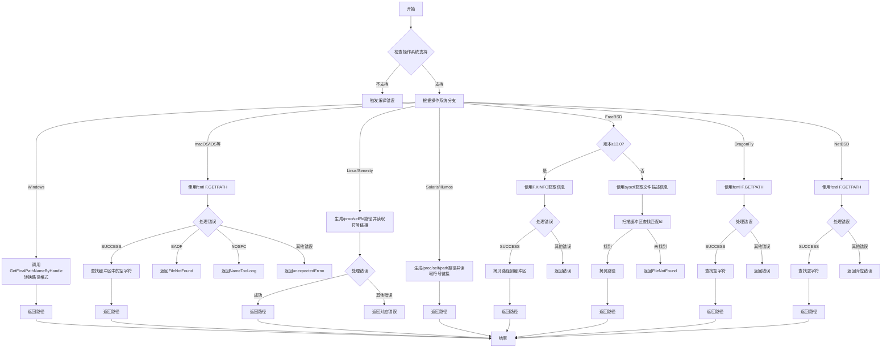

嗯，我需要根据提供的Zig代码绘制一个流程图。首先，我得理解这个函数的功能。这个函数是`getFdPath`，用于获取文件描述符（fd）的路径。不同操作系统有不同的实现方式，所以函数里有很多条件分支。

首先，函数检查当前操作系统是否支持`getFdPath`，如果不支持，会触发编译错误。这部分应该在流程图的开始，作为第一个判断节点。

接下来，根据不同的操作系统，有不同的处理逻辑。比如Windows、macOS系列、Linux、Solaris、FreeBSD、DragonFly BSD、NetBSD等。每个操作系统分支有不同的实现方法。

对于Windows，它使用`GetFinalPathNameByHandle`函数，并将结果从宽字符转换为UTF-8。这部分需要转换为流程图中的一个分支，处理Windows的情况。

对于macOS及其衍生系统，使用`fcntl`的`F.GETPATH`命令，需要处理可能的错误码，并返回路径。这里需要处理错误情况，比如`FileNotFound`或`NameTooLong`。

Linux和Serenity系统使用`/proc/self/fd/`来读取符号链接。这里可能需要处理读取链接的过程及可能的错误。

Solaris和Illumos使用类似的proc路径，但路径结构不同，处理方式与Linux类似。

FreeBSD部分有版本检查，13.0及以上版本使用`fcntl`的`F.KINFO`命令，否则使用sysctl来获取信息。这里有两个子分支，需要分别处理。

DragonFly BSD和NetBSD也使用`fcntl`的`F.GETPATH`，但错误处理略有不同，需要单独分支。

最后，其他未明确列出的操作系统会触发`unreachable`，因为前面的检查已经排除了不支持的系统。

在绘制流程图时，需要注意各个分支的条件判断，以及每个分支内的处理步骤和错误处理。可能需要用不同的形状表示开始、判断、操作、结束等步骤。

需要确认每个操作系统的分支是否正确，以及各步骤之间的逻辑连贯。可能有些错误处理需要特别标注，比如返回不同的错误类型。

总结来说，流程图的结构大致如下：
1. 开始
2. 检查操作系统是否支持，否则编译错误
3. 根据不同的OS分支处理
   a. Windows
   b. macOS系列
   c. Linux/Serenity
   d. Solaris/Illumos
   e. FreeBSD（分版本）
   f. DragonFly BSD
   g. NetBSD
4. 每个分支内部的具体步骤和错误处理
5. 返回结果或错误

需要注意各步骤之间的连接，以及可能的错误路径。此外，确保所有可能的返回路径都被涵盖，比如正常返回路径和各种错误返回。
================================================
