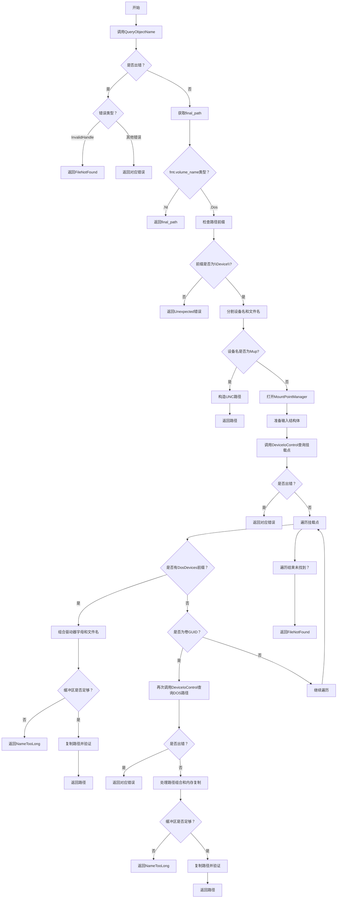

嗯，我需要用Mermaid画出这个Zig函数的流程图。首先，我得理解这个函数的结构和逻辑。这个函数是GetFinalPathNameByHandle，它接收一个文件句柄、格式参数和输出缓冲区，返回处理后的路径或错误。

首先，函数调用QueryObjectName，如果出错的话会处理错误，比如InvalidHandle转成FileNotFound。这部分应该是一个判断框，检查错误类型，然后决定返回哪个错误。

接下来是switch语句，根据fmt.volume_name的不同进行处理。这里有两个分支：.Nt和.Dos。对于.Nt的情况，直接返回final_path，比较简单。而.Dos的情况比较复杂，需要处理不同的路径格式转换。

在.Dos分支中，首先检查路径是否以"\Device\"开头，如果不是就返回错误。然后尝试找到路径中的反斜杠，分割出设备名和文件名。如果设备名是"Mup"，处理UNC路径，构造新的路径返回。

如果不是"Mup"，就需要查询DOS卷名。这里涉及到调用DeviceIoControl两次，第一次查询挂载点，第二次查询DOS卷路径。这部分流程可能会有循环遍历挂载点，检查是否有符合条件的前缀，比如"\DosDevices\"，如果有，就组合驱动器字母和文件名返回。如果没有，可能需要处理卷GUID，再次查询DOS路径，然后组合路径。

在处理卷GUID的情况下，再次调用DeviceIoControl，获取卷路径，然后处理输出缓冲区的复制，需要考虑内存重叠的情况，决定是向前还是向后复制。最后验证路径中没有空字符，返回结果。

整个流程中有很多错误检查和返回，需要将这些判断点都体现在流程图中。比如检查缓冲区长度是否足够，是否找到有效的挂载点等，如果失败则返回相应的错误。

可能的结构是：开始 -> QueryObjectName -> 错误处理 -> 分支.Nt/.Dos -> 对于.Dos，分解路径 -> 处理MUP -> 否则查询挂载点 -> 遍历挂载点 -> 检查DosDevices前缀 -> 找到则组合路径 -> 否则处理卷GUID -> 再次查询 -> 处理路径组合 -> 最终返回或错误。

需要注意循环和条件分支的嵌套，确保流程图正确反映代码的逻辑结构。可能需要使用多个判断框和子流程来表示不同的处理步骤。
================================================
