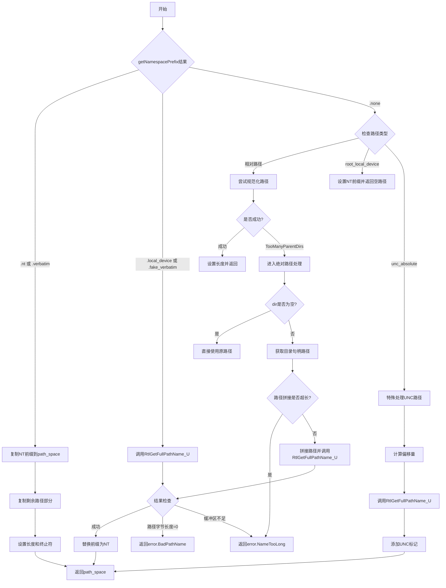

嗯，我需要用Mermaid来画这个函数的流程图。首先，我得仔细读一遍这个函数的代码，理解它的逻辑结构。这个函数的名字是wToPrefixedFileW，看起来是处理Windows路径转换的。函数接收一个目录句柄和路径，返回一个处理后的路径空间，或者在出错时返回错误。

首先，函数开头定义了一个nt_prefix，也就是四个字符的数组：\? ? \。然后根据getNamespacePrefix的结果分成了不同的情况。看起来有三种情况：.nt或.verbatim，.local_device或.fake_verbatim，以及.none。每种情况下处理路径的方式不同。

对于.nt或.verbatim的情况，直接复制nt_prefix到path_space，然后复制剩下的路径部分，最后设置长度和终止符。这部分比较简单。

对于.local_device或.fake_verbatim的情况，调用RtlGetFullPathName_U来获取完整路径，处理可能的错误，然后替换前缀为nt_prefix。这里需要处理错误，比如路径名错误或名称过长。

第三种情况是.none，这时候需要进一步判断路径类型。路径可能是相对路径、根本地设备路径、UNC绝对路径或其他。对于相对路径，尝试规范化路径，如果遇到太多上级目录错误，则转到另一个处理分支。如果路径是根本地设备路径（比如\\.或\\?），则直接设置nt_prefix并返回。对于UNC绝对路径，需要特殊处理，添加UNC到路径中。

在处理相对路径时，如果目录句柄不为空，可能需要获取目录的最终路径，并拼接相对路径。这里还涉及到错误处理，比如无法识别的卷或其他错误。

整个过程需要分步骤绘制流程图，每个判断和操作都需要一个节点。可能的错误路径也需要表示出来，比如返回error.BadPathName或error.NameTooLong等。

可能需要先画一个开始节点，然后根据不同的情况分支。每个switch case对应不同的流程分支。在处理.none的情况下，又有多个子判断，比如路径类型是否为相对路径、是否为根本地设备、是否为UNC绝对路径等。每个子判断都会有对应的处理步骤。

在绘制时需要注意条件判断的顺序和流程的正确性，确保每个可能的执行路径都被覆盖。此外，函数中有些TODO注释，比如处理特殊设备名称，这些可能在流程图中用注释或占位符表示。

总之，流程图的结构应该是这样的：开始 -> 检查namespace前缀 -> 根据不同的情况处理路径 -> 处理可能的错误 -> 结束。每个主要分支都需要详细展开，特别是.none情况下的各种子分支。
================================================
