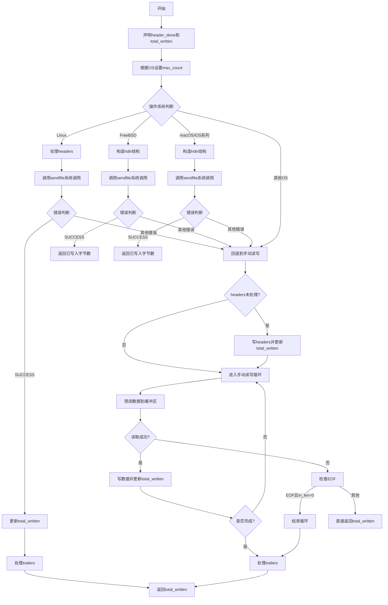

嗯，我需要为这个Zig语言编写的sendfile函数画一个流程图。首先，我应该通读代码，理解它的结构和逻辑流程。这个函数的主要作用是在不同操作系统（如Linux、FreeBSD、macOS等）上实现sendfile的功能，同时处理头部和尾部的数据，以及错误处理。

首先，函数开始声明变量header_done和total_written。接着，根据不同的操作系统，设置max_count的值。然后，通过switch语句处理不同操作系统的具体实现。

对于Linux部分，函数先处理headers，使用writev写入，如果成功则继续调用sendfile系统调用。这里需要处理可能的错误，并根据错误类型决定是继续还是回退到手动读写。之后处理trailers。

FreeBSD和macOS/iOS等系统的处理类似，使用sendfile并处理hdtr结构来包含headers和trailers。同样需要处理各种错误，并在必要时回退到手动读写。

如果操作系统不在上述列表中，或者回退到手动读写的情况，函数会先处理headers，然后使用缓冲区读取数据并写入到输出文件描述符，最后处理trailers。

在手动读写部分，函数使用pread读取数据，然后write写入，循环直到完成或出错。最后处理trailers。

接下来，我需要将这些步骤转化为流程图。流程图应该包括开始、结束、条件判断、循环、函数调用和错误处理。每个操作系统分支需要单独处理，并且回退到手动读写的路径需要明确标出。

可能需要注意的细节包括错误处理的分支、循环结构（如while(true)）、以及不同操作系统特有的逻辑。另外，变量如header_done和total_written的状态变化也需要在流程中体现。

在绘制流程图时，可能需要将主要操作系统的处理作为子流程，然后展示它们的共同回退路径。同时，手动读写部分作为独立模块，处理headers、数据块和trailers。

需要确保流程图的连贯性，每个判断节点（如操作系统类型、错误类型）都有明确的分支，并且最终汇总到返回total_written的结束节点。
================================================

流程图说明：
1. 函数入口初始化变量后根据操作系统选择不同实现路径
2. Linux/FreeBSD/macOS分别有各自的sendfile系统调用封装
3. 所有系统调用失败后统一回退到手动读写路径
4. 手动读写路径包含headers处理、分块读写循环、trailers处理
5. 最终通过多路径汇聚到返回total_written的结束节点
6. 错误处理贯穿整个流程，通过条件判断实现异常分支跳转