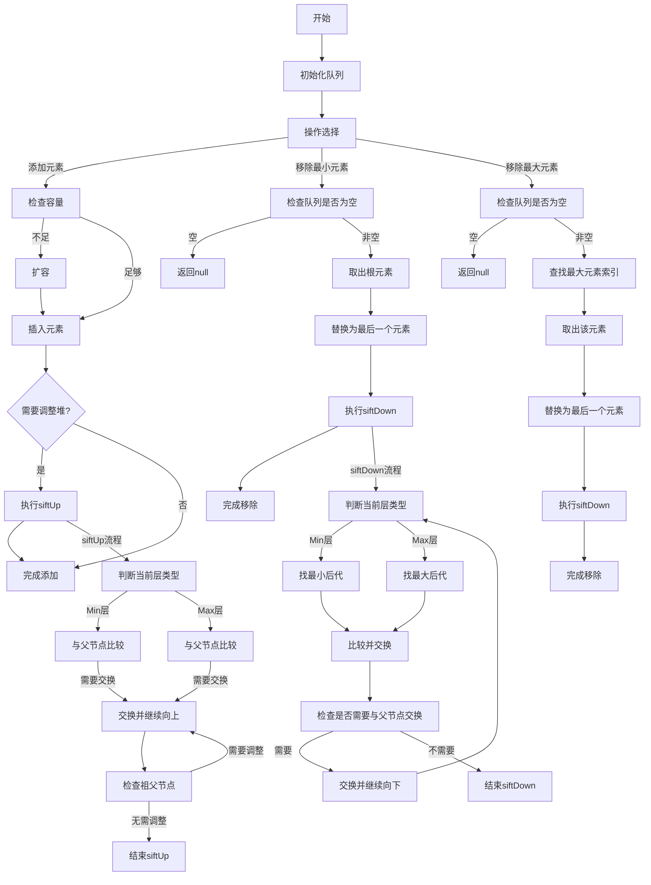

好的，我现在需要为提供的Zig代码中的PriorityDequeue函数绘制一个流程图。首先，我需要理解这段代码的结构和功能。看起来这是一个优先级队列（或双端队列）的实现，基于min-max堆结构。代码中包含了初始化、释放内存、添加元素、删除元素（最小和最大）、调整堆结构等方法。

首先，我应该确定流程图的范围。用户希望的是整个PriorityDequeue函数的流程图，但考虑到这是一个复杂的结构体，包含多个方法，可能需要分步骤处理。或者，用户可能希望的是某个特定方法的流程图，比如add或removeMin。但根据问题描述，可能是指整个结构体的主要流程。

接下来，我需要识别主要的函数和它们之间的关系。例如，init用于初始化，deinit释放内存，add和addSlice用于添加元素，peekMin和peekMax查看元素，removeMin和removeMax移除元素，siftUp和siftDown用于维护堆结构，等等。

流程图通常从入口点开始，比如初始化，然后根据操作分支，比如添加元素、移除元素等。每个操作内部可能涉及条件判断和循环，比如在添加元素时可能需要调整堆结构，这涉及到siftUp或siftDown的过程。

可能的挑战是如何将复杂的堆调整逻辑（如min-max层的判断、siftUp和siftDown的具体步骤）简化为流程图中的节点。同时，需要确保流程图的清晰度，避免过于复杂。

我需要考虑使用Mermaid语法中的不同形状，比如矩形表示过程，菱形表示判断，箭头表示流程方向。可能需要将主要的方法作为子流程，并在主流程中引用它们。

例如，主流程可能包括初始化、添加元素、移除元素等步骤。每个步骤内部可能有自己的子流程。比如，添加元素时，首先检查容量，然后插入元素，之后进行siftUp调整。siftUp可能涉及判断当前层是min还是max，然后决定交换元素的方向。

另一个例子是移除最小元素时，取出根元素，将最后一个元素移到根部，然后进行siftDown调整。siftDown需要判断子节点或孙子节点中的最优元素，并进行交换，直到满足堆条件。

可能需要为每个关键函数（如add、removeMin、siftUp、siftDown）创建子流程图，然后在主流程图中引用这些子流程。但根据用户的需求，可能需要一个总体的高层次流程图，而不是深入到每个函数的细节。

还需要注意代码中的一些辅助函数，比如parentIndex、grandparentIndex等，这些可能在流程中作为计算步骤出现。

在绘制流程图时，需要确保逻辑的正确性，比如在add元素时，如果当前层是min层，则可能需要与父节点比较并交换，以维持堆结构。同样，在siftDown时，需要处理不同层（min或max）的不同比较逻辑。

可能还需要考虑错误处理，比如内存分配失败时的处理，但代码中使用的是Zig的错误处理（try），在流程图中可能需要体现这一点。

总结来说，流程图的绘制需要涵盖以下几个主要部分：
1. 初始化队列
2. 添加元素（包括扩容、插入、调整堆）
3. 移除最小/最大元素（包括取出元素、调整堆）
4. 堆调整过程（siftUp和siftDown的具体步骤）
5. 辅助函数（如索引计算、比较等）

每个部分需要分解为步骤和判断条件，使用Mermaid语法正确表示。
================================================

该流程图主要包含以下部分：
1. 初始化队列
2. 添加元素时的容量检查和堆调整（siftUp）
3. 移除最小/最大元素时的堆调整（siftDown）
4. siftUp和siftDown的详细调整逻辑
5. 操作选择分支（添加/移除最小/移除最大）
通过菱形判断节点和子流程节点，展现了min-max堆的核心操作流程。