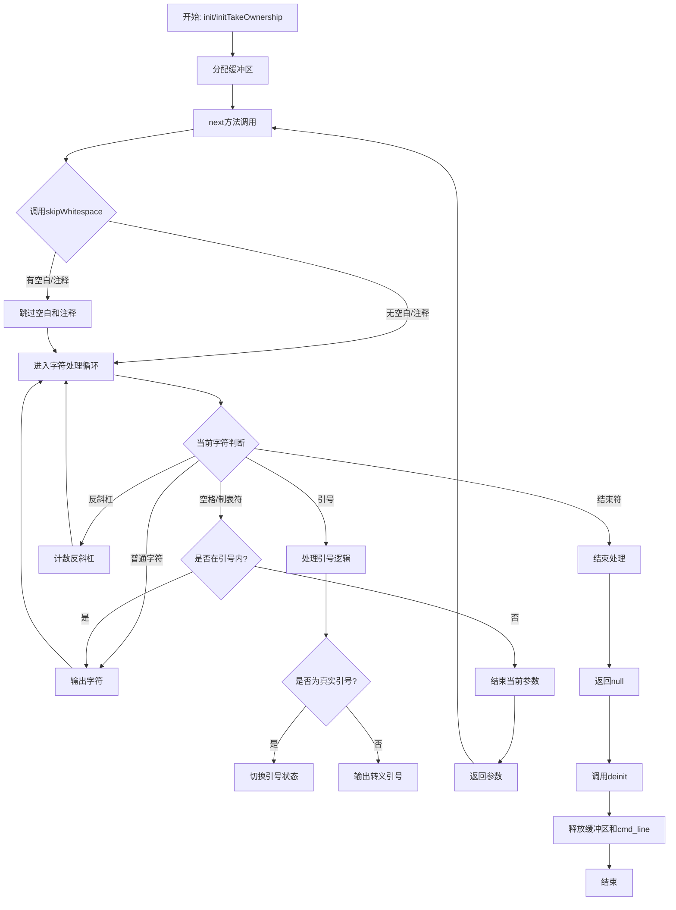

好的，我现在需要为给定的Zig代码绘制一个流程图。首先，我得仔细理解这段代码的功能和结构。

这段代码定义了一个名为`ArgIteratorGeneral`的泛型函数，它返回一个结构体类型。该结构体用于迭代处理命令行参数，具有初始化、跳过空白、处理引号和反斜杠、获取下一个参数以及释放资源的方法。

首先，我需要确定流程图的起点和终点。起点应该是`init`或`initTakeOwnership`方法，它们初始化结构体实例。终点是`deinit`方法，释放资源。

接下来，主要的处理流程在`next`方法中，它负责逐个获取参数。这里涉及跳过空白、处理引号、反斜杠以及分割参数。此外，`skipWhitespace`和`skip`方法也参与处理空白和注释。

需要考虑的条件分支包括：是否遇到引号、反斜杠、空白字符，以及是否在引号内。此外，注释处理是否启用也是一个条件。

可能的流程步骤如下：
1. 初始化结构体，分配缓冲区。
2. 跳过空白和可能的注释。
3. 处理每个字符，根据是否在引号内、反斜杠数量来决定字符的处理方式。
4. 遇到分隔符（如空格）且不在引号内时，返回当前参数。
5. 循环处理直到字符串结束。
6. 释放缓冲区。

需要注意的是错误处理和资源释放部分，例如`errdefer`在初始化时的使用。

现在需要将这些步骤转化为流程图，使用mermaid语法。每个方法作为流程节点，条件判断使用菱形框，箭头表示流程方向。

可能的结构：
- 开始于init或initTakeOwnership
- 进入next方法
  - 调用skipWhitespace
    - 处理空白和注释
  - 处理每个字符，判断是否为特殊字符（引号、反斜杠、空格）
  - 根据条件决定是否结束当前参数
- 返回参数或null
- 最终调用deinit释放资源

需要确保所有分支都被覆盖，包括引号内外的不同处理，反斜杠转义，以及注释是否启用的情况。

最后，检查流程是否符合代码逻辑，确保没有遗漏重要的步骤或条件。
================================================
