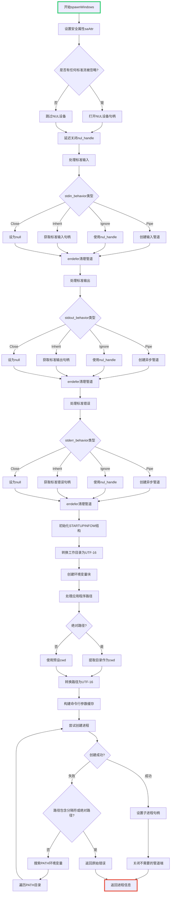

嗯，用户给了我一个用Zig语言写的函数`spawnWindows`，属于`Child.zig`文件的一部分，想要我用Mermaid画出这个函数的流程图。首先，我需要理解这个函数的功能和结构。

这个函数看起来是用来在Windows上创建子进程的。函数里处理了标准输入、输出、错误的管道设置，还有安全属性，环境变量，以及执行路径的处理。需要理清各个步骤的顺序和条件分支。

首先，函数开始设置安全属性`saAttr`，然后检查是否有任何标准流被忽略，如果有的话，打开NUL设备。接下来，分别为标准输入、输出、错误处理不同的行为（Pipe、Ignore、Inherit、Close），创建相应的管道或句柄。然后初始化`STARTUPINFOW`结构，准备进程启动信息。

之后处理工作目录（cwd）和应用程序路径，将路径从UTF-8转换为UTF-16。然后尝试创建进程，如果失败，会搜索PATH环境变量中的路径。最后，设置子进程的句柄，关闭不需要的管道端，并返回结果。

接下来，我需要将这些步骤转化为流程图。流程图的开始是函数入口，然后依次处理各个标准流的设置，准备启动信息，处理路径和目录，尝试创建进程，错误处理，最后清理资源并返回。

需要注意的是条件分支，比如是否有忽略的流，不同的标准流处理方式，以及路径搜索的情况。还有错误处理部分，比如在创建进程失败时搜索PATH。

可能需要使用不同的形状来表示开始/结束、操作步骤、条件判断、循环等。例如，矩形表示操作，菱形表示条件判断，平行四边形表示输入/输出，箭头表示流程方向。

需要确保每个主要步骤都被正确映射到流程图中，包括错误处理的路径。同时，要处理`defer`语句，确保资源释放的流程正确。

可能还需要简化一些细节，比如具体的错误类型处理，保持流程图的可读性。同时，注意函数中的循环结构，比如搜索PATH时的`while`循环。

最后，检查流程图是否符合Mermaid语法，确保节点和连接正确无误。
================================================
