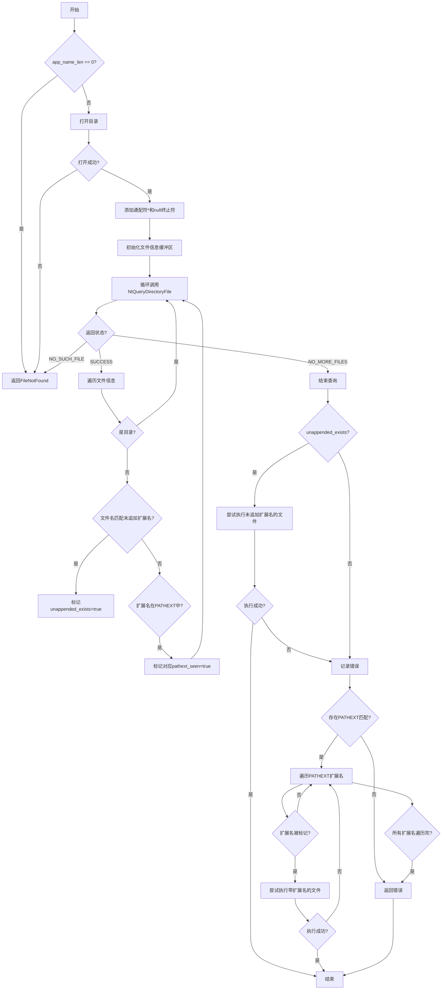

嗯，我需要用Mermaid来画这个函数的流程图。首先，我得仔细读一下这个Zig代码，理解它的结构和逻辑。这个函数叫做windowsCreateProcessPathExt，看起来是处理在Windows上创建进程的路径扩展的。

首先，函数开头有一些参数，比如allocator、dir_buf、app_buf、pathext等。然后检查app_name_len是否为0，如果是的话返回FileNotFound错误。接着是defer语句，用于在函数返回时恢复app_buf和dir_buf的原始长度。

接下来，函数尝试打开一个目录，可能是当前工作目录或者PATH中的某个路径。这里用到了fs.cwd().openDirW，如果失败的话返回FileNotFound。然后给app_buf添加通配符*和null终止符，形成app_name_wildcard，用于后续的文件查询。

之后，使用NtQueryDirectoryFile来查询目录中的文件信息，检查是否有匹配app_name_wildcard的文件。这里处理了不同的返回码，比如SUCCESS、NO_SUCH_FILE、NO_MORE_FILES等。在遍历文件信息时，跳过目录，检查文件名是否符合未追加扩展名或者支持的PATHEXT扩展名。

然后，处理未追加扩展名的情况（unappended_exists），如果存在这样的文件，尝试创建进程。如果失败，记录错误。接着处理PATHEXT扩展的情况，遍历每个扩展，检查是否在查询结果中出现过，如果存在则尝试用该扩展创建进程。

整个流程的逻辑是：首先检查是否有未加扩展名的可执行文件，如果有则尝试执行；如果没有或者执行失败，再尝试所有支持的PATHEXT扩展名，直到找到可以执行的为止。如果都失败，返回错误。

现在需要把这些步骤转化为Mermaid流程图。流程图应该包括开始、判断、操作、结束等节点。需要注意循环和条件分支的结构，比如处理NtQueryDirectoryFile的循环，以及处理不同扩展名的循环。

可能的节点包括：
1. 开始
2. 检查app_name_len是否为0 → 是则返回FileNotFound
3. 打开目录 → 失败则返回FileNotFound
4. 添加通配符和null终止符
5. 初始化文件信息缓冲区
6. 循环查询目录文件信息
   a. 处理返回码
   b. 遍历文件信息，检查文件名
7. 检查是否存在未追加扩展名的文件 → 是则尝试执行
8. 如果执行失败，处理错误
9. 遍历PATHEXT扩展名，检查是否存在对应的文件 → 是则尝试执行
10. 如果所有尝试都失败，返回错误
11. 结束

需要注意循环和条件分支的连接，以及错误处理路径。可能需要使用子流程来简化复杂的部分，比如处理文件查询和扩展名检查的部分。
================================================
