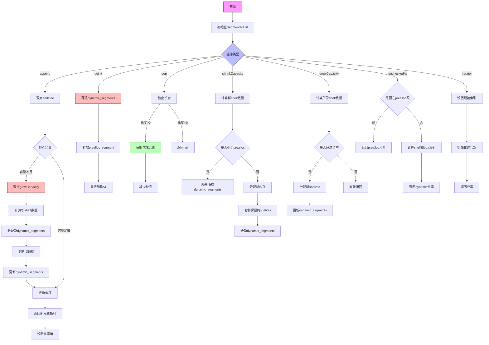

好的，我现在需要帮用户用Mermaid画出一个Zig函数的流程图。用户提供的代码是SegmentedList.zig中的pub fn SegmentedList函数，看起来这是一个生成结构体的泛型函数，用于创建一个分段列表的数据结构。首先，我需要理解这个函数的结构和逻辑，然后将其转化为流程图。

首先，我需要明确这个函数的主要功能。SegmentedList似乎是一个动态数组，结合了预分配的空间和动态分配的分段存储。用户可能希望通过流程图展示初始化、添加元素、扩容、缩容等操作的过程。

接下来，我需要分析代码中的各个方法，如deinit、append、pop、addOne、growCapacity、shrinkCapacity等，并确定它们之间的调用关系和流程。例如，当调用append时，会调用addOne，进而可能触发growCapacity。而growCapacity可能会分配新的动态段，并处理错误情况。

然后，我需要考虑如何将这些方法组织成流程图。可能需要从初始化开始，展示各个操作如何触发不同的方法，包括内存分配、数据拷贝、错误处理等步骤。每个方法中的关键判断条件，比如检查是否需要扩容或缩容，是否在预分配段内，或者是否需要释放内存等，都是流程图中需要体现的分支点。

另外，代码中有一些辅助函数，如shelfCount、shelfSize、shelfIndex、boxIndex等，这些可能在流程图中作为子流程出现，或者在主流程中被调用。需要确定是否需要在流程图中详细展开这些辅助函数，或者仅在主流程中提及它们的用途。

还需要注意错误处理部分，例如在growCapacity中使用errdefer来释放分配失败时的资源。这些错误处理流程应该在流程图中有所体现，展示在分配失败时的回滚操作。

由于代码较为复杂，涉及多个方法和状态变化，我需要确保流程图的结构清晰，层次分明，每个步骤和条件判断都准确无误。可能需要将整个SegmentedList的生命周期分解为初始化、添加元素、删除元素、扩容、缩容、销毁等主要阶段，每个阶段内部再细化步骤和条件分支。

最后，根据Mermaid的语法，将各个步骤和判断用节点和箭头连接起来，形成完整的流程图。需要检查流程是否覆盖所有关键路径，包括正常流程和异常处理流程，确保逻辑正确性。

总结来说，我需要分步骤分析每个主要函数的工作流程，确定它们的调用关系和条件分支，然后用Mermaid语法绘制出结构清晰、逻辑正确的流程图。
================================================
