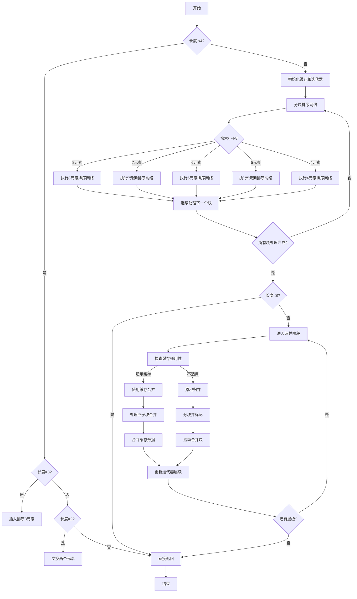

嗯，我需要帮用户把这段Zig代码中的`block`函数画成流程图。首先，我应该通读代码，理解它的结构和逻辑。这个函数看起来像是一个排序算法的实现，可能类似于归并排序或者块排序。代码中有很多条件判断和循环，还有处理不同长度数组的情况。

首先，函数参数部分，接收一个类型`T`，一个切片`items`，上下文`context`，和一个比较函数`lessThanFn`。然后在调试模式下，`lessThan`函数会进行一些断言检查，确保比较函数的一致性。

接下来，处理长度小于4的情况，直接进行插入排序。如果长度是3或2，就手动交换元素。这部分逻辑比较简单，可以画成几个条件分支。

然后是处理更长的数组，使用一种分块的排序网络。代码中有一个`Iterator`，分块处理数据，每个块的大小可能是4到8。根据不同的块大小，有不同的交换步骤，比如对于8个元素的情况，有多个`swap`操作。这部分可能需要用循环结构来表示，每个块大小对应不同的交换逻辑。

之后是归并排序的部分，使用缓存`cache`来合并块。这里分为两种情况：如果块大小适合缓存，就使用缓存进行合并；否则使用原地归并的逻辑。代码中有很多关于合并的逻辑，比如`mergeInto`、`mergeExternal`等函数调用，需要理清这些步骤。

在处理合并时，还涉及到内部缓冲区的管理，比如`buffer1`和`buffer2`，以及如何调整块大小和缓冲区大小。这部分逻辑比较复杂，可能需要多个判断和循环结构。

最后，当合并完成后，对剩余的缓冲区进行插入排序，并重新分配缓冲区的内容。整个过程通过`iterator.nextLevel()`控制，直到所有层级处理完毕。

在绘制流程图时，我需要将这些步骤分解成不同的节点，用条件判断连接起来。可能需要从顶层开始，先处理小数组的情况，再进入分块排序，然后是归并阶段，最后处理缓冲区。每个主要步骤都需要对应的判断和循环结构，比如处理不同块大小的交换，合并时的缓存使用等。

需要注意的是，代码中有很多细节，比如`swap`函数的调用、缓冲区的分配和管理，这些都需要在流程图中适当体现。同时，错误处理和调试模式下的断言检查也需要考虑进去，不过可能用户更关注主流程。

可能需要将整个流程分成几个主要部分：初始化、处理小数组、分块排序、归并处理、缓冲区管理、结束条件。每个部分内部再展开详细步骤。使用Mermaid的流程图语法，用矩形框表示步骤，菱形框表示条件判断，箭头表示流程走向。

总之，我需要一步步拆解代码，将每个主要逻辑块转化为流程图中的节点，并确保逻辑顺序正确，条件分支清晰。
================================================

该流程图主要展示了以下关键路径：
1. 对长度小于4的数组直接进行简单排序
2. 对4-8长度的块使用排序网络
3. 大数组时进入多级归并阶段：
   - 优先使用缓存进行合并操作
   - 缓存不足时使用原地归并算法
   - 通过迭代器管理合并层级
4. 最终处理缓冲区并完成排序

菱形节点表示条件判断，矩形节点表示处理步骤，箭头表示程序执行流向。完整实现还包含更细粒度的内存操作和边界处理，但核心流程已在此图中体现。