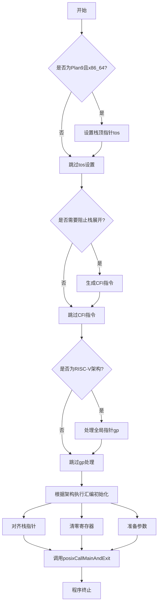

好的，我现在需要为提供的Zig函数`_start`画一个流程图。首先，我需要理解这个函数的结构和逻辑。

函数`_start`是一个入口点，使用`.naked`调用约定，意味着它不会自动生成函数序言和尾声。它被标记为`noreturn`，意味着这个函数不会返回，而是会终止程序或进入无限循环。

首先，函数检查当前的操作系统和架构是否为Plan9和x86_64，如果是，就设置栈顶指针`tos`。这部分对应流程图中的一个条件判断分支。

接下来，针对不同的架构生成特定的汇编代码，目的是阻止调试器继续展开栈帧。这里可能需要根据不同的架构处理不同的情况，但流程图中的处理可以简化为一个判断是否有解包表或未剥离调试信息，然后执行相应的汇编指令。

然后，针对RISC-V架构有特殊的处理，使用内联汇编设置全局指针。这里可能需要另一个条件分支，判断是否为RISC-V架构，并执行相应的汇编代码。

接下来是主要的汇编部分，根据不同的CPU架构执行不同的初始化操作，比如清零基址指针、对齐栈指针、调用主函数等。这部分需要为每个支持的架构生成对应的流程节点，但由于架构众多，可能在流程图中合并为多个分支处理，或者简化为一个通用的处理步骤，指出根据架构执行不同的汇编指令。

最后，所有路径都会调用`posixCallMainAndExit`函数，并在此之后终止程序。因此，流程图的最终节点是这个调用和程序退出。

需要注意的是，由于涉及多个架构的特殊处理，流程图可能变得非常复杂。但根据用户要求，可能需要将主要逻辑结构简化，突出条件分支和主要操作步骤，而不是详细列出每个架构的具体汇编代码。

可能的步骤如下：

1. 函数开始。
2. 检查是否为Plan9和x86_64架构，是则设置栈顶指针。
3. 检查是否需要阻止栈展开，执行相应的CFI指令。
4. 如果是RISC-V架构，处理全局指针。
5. 根据当前架构执行相应的汇编初始化（对齐栈、清零寄存器等）。
6. 调用posixCallMainAndExit。
7. 程序终止。

在绘制流程图时，每个条件判断对应一个菱形节点，操作用矩形节点，箭头表示流程方向。由于架构众多，可能需要将步骤5合并为一个多分支节点，或者简化为一个通用处理步骤，然后调用主函数。

需要确认是否所有架构的处理最终都会调用posixCallMainAndExit，根据代码中的内联汇编，每个架构的代码最后都是调用这个函数，因此流程图的主线是正确的。
================================================
