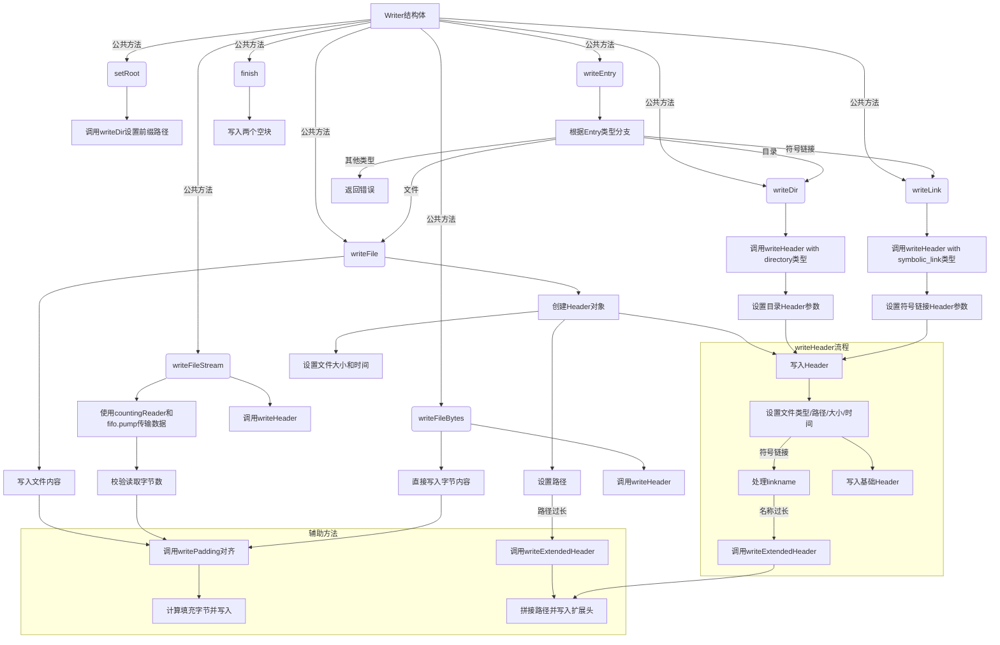

好的，我需要帮用户用Mermaid画出这个Zig函数的流程图。首先，我得仔细看一下这个代码的结构。这个函数`Writer`是一个泛型函数，返回一个结构体，里面有很多方法，比如`writeDir`、`writeFile`、`writeFileStream`等等。每个方法有不同的逻辑，所以流程图需要涵盖主要的公共方法以及它们之间的调用关系。

首先，我会先确定入口点，可能是用户调用的公共方法，比如`setRoot`、`writeDir`、`writeFile`等。然后，每个方法内部可能调用其他私有方法，比如`writeHeader`、`writePadding`、`writeExtendedHeader`等，这些也需要在流程图中体现。

需要注意循环和条件分支，例如在`writeFileStream`中使用`fifo.pump`来读取数据，这里可能有循环处理数据的过程。还有在`setPath`中处理路径过长时写入扩展头部的逻辑，这涉及到条件判断。

另外，异常处理也需要考虑，比如各个方法中的`try`关键字，表示可能返回错误，这些错误处理是否需要在流程图中体现？用户可能更关注正常流程，但如果有重要的错误分支，也应该标注。

接下来，我需要将每个方法分解成步骤，并用Mermaid的流程图语法表示。例如，`writeFile`的流程可能是：创建Header，设置路径，设置大小和时间，写入Header，写入文件内容，写入填充。而`writeHeader`则会设置各种属性，并可能触发写入扩展头部。

还要注意方法之间的调用关系，比如`writeDir`调用`writeHeader`，而`writeHeader`又可能调用`writeExtendedHeader`。这些调用链需要用子流程或节点连接起来。

最后，要确保流程图的逻辑清晰，步骤分明，不会遗漏重要的分支和处理步骤。可能需要多次检查代码，确保每个公共和私有方法都被正确表示在流程图中。
================================================
