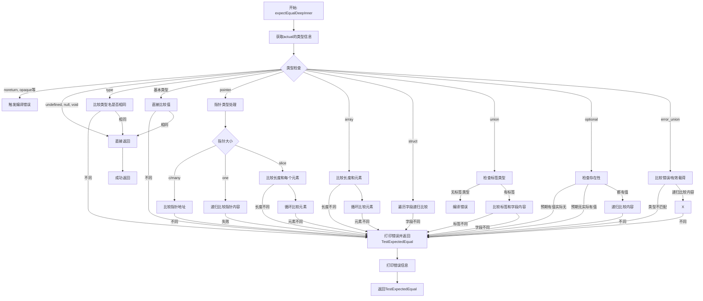

嗯，我现在需要帮用户用Mermaid画出他们提供的Zig函数的流程图。首先，我得仔细阅读这个函数，理解它的逻辑结构。这个函数叫做expectEqualDeepInner，看起来是用来深度比较两个值是否相等的，可能在单元测试中使用。

首先，函数接收三个参数：类型T，期望值expected和实际值actual。返回一个错误或者void。然后函数内部根据actual的类型信息进行不同的处理。

接下来，我需要理清这个函数的结构。函数开始使用了一个switch语句，根据@typeInfo(@TypeOf(actual))的结果来处理不同的类型。每个case对应不同的类型，比如.noreturn、.opaque等会触发编译错误，而像基本类型（bool、int等）则直接比较值是否相等。对于复杂类型如指针、数组、结构体、联合体等，会递归调用expectEqualDeep来进行深度比较。

那么，我需要把每个switch的分支转化为流程图中的不同节点。流程图的开始是函数入口，然后根据类型信息分支到不同的处理逻辑。每个分支可能有子处理步骤，比如指针类型下又分不同的指针大小（如c、many、one、slice），每个子分支又有不同的处理方式。例如，对于切片指针，会检查长度，然后逐个比较元素。

对于结构体，会遍历每个字段进行比较；联合体需要检查标签是否一致，再比较对应字段；可选类型需要处理是否有值的情况；错误联合体则要处理是否包含错误或有效载荷等。

需要注意的是，递归调用expectEqualDeep的地方可能需要表示为子流程或者循环结构。例如，在处理数组或切片时，会有循环遍历每个元素进行比较，这时候可能需要一个循环节点，表示逐个元素检查，直到所有元素比较完毕或出现错误。

在绘制流程图时，可能需要使用不同的形状来表示不同的操作，比如菱形表示判断，矩形表示处理步骤，平行四边形表示输入输出，圆形或椭圆形表示开始和结束。同时，错误处理的部分（如返回error.TestExpectedEqual）也需要在流程图中体现出来，可能通过不同的箭头路径表示错误返回。

另外，需要考虑如何处理递归调用。比如，当处理结构体的字段时，每个字段的比较都会再次调用expectEqualDeep，这在流程图中可能需要表示为子流程或者嵌套的流程结构。但为了简化，可能在主流程中表示为循环遍历字段并进行比较。

可能遇到的挑战是如何将复杂的类型处理和递归调用清晰地展现在流程图中，避免过于复杂。可能需要分层次绘制，先画出主流程，然后为每个复杂类型处理绘制子流程图。不过根据用户的要求，可能需要一个整体的流程图，所以需要合理组织节点和分支，确保可读性。

总结一下，流程图的步骤大致如下：

1. 函数开始，检查类型信息。
2. 根据不同的类型分支处理：
   a. 触发编译错误的类型（如noreturn）直接报错。
   b. 简单类型（如bool、int）直接比较值。
   c. 指针类型根据指针大小处理，可能需要递归比较指向的值。
   d. 数组、切片、向量逐个元素比较。
   e. 结构体遍历每个字段比较。
   f. 联合体检查标签后比较对应字段。
   g. 可选类型检查是否存在值并进行比较。
   h. 错误联合体比较错误或有效载荷。
3. 在比较过程中，如果发现不匹配，打印错误信息并返回错误。
4. 所有比较通过后返回成功。

接下来需要将这些步骤转化为Mermaid的流程图语法，注意正确使用节点和箭头，处理循环和递归的情况，确保逻辑清晰。
================================================

流程图说明：
1. 函数入口后先获取类型信息进行分派
2. 对编译期不支持的类型直接报错
3. 对简单值类型直接进行值比较
4. 复合类型（指针/数组/结构体等）采用递归比较策略
5. 每个比较失败路径都会打印具体差异信息
6. 最终只有所有比较通过才会正常返回
7. 采用深度优先的递归比较策略处理嵌套数据结构