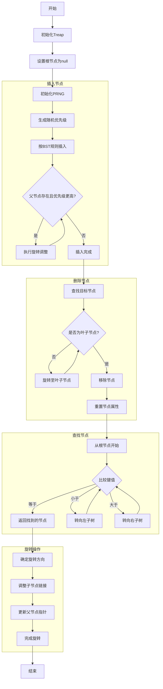

好的，我需要帮助用户理解如何为提供的Zig代码中的Treap数据结构绘制流程图。首先，我需要仔细阅读并理解这段代码的结构和各个部分的功能。

首先，Treap是一个结合了二叉搜索树（BST）和堆（Heap）特性的数据结构。每个节点都有一个键（遵循BST的排序）和一个优先级（遵循堆的性质）。代码中定义了Treap结构体，包含了根节点、PRNG（伪随机数生成器），以及一些方法如插入、删除、旋转等。

接下来，我需要确定流程图的主要部分。通常，数据结构的流程图会包括初始化、插入节点、删除节点、查找节点、旋转操作等步骤。此外，Treap特有的操作，如根据优先级调整节点位置，也需要在流程图中体现。

1. **初始化Treap**：创建Treap实例，初始化根节点为null，设置PRNG。
2. **插入节点**：
   - 生成随机优先级。
   - 按照BST规则插入节点。
   - 通过旋转调整节点位置以满足堆的优先级。
3. **删除节点**：
   - 将节点旋转至叶子节点。
   - 删除叶子节点。
   - 调整树结构以保持Treap性质。
4. **查找节点**：根据键值进行BST标准的查找。
5. **旋转操作**：左旋或右旋以调整树结构，保持堆性质。

在绘制流程图时，需要注意各个步骤之间的连接和条件判断。例如，插入节点后是否需要旋转，取决于父节点的优先级是否高于当前节点。删除节点时需要先旋转至叶子节点，再进行删除。

另外，代码中的Entry结构用于管理节点的插入、替换和删除，这也需要在流程图中有所体现，尤其是在处理节点存在与否的不同情况。

可能遇到的挑战是如何将递归或循环操作（如旋转直到满足条件）清晰地表示在流程图中。使用条件判断框和循环结构可以解决这个问题。

最后，需要确保流程图的每个步骤与代码中的函数和方法对应，例如insert、remove、rotate等，这样用户可以通过流程图快速理解代码的执行流程。
================================================
