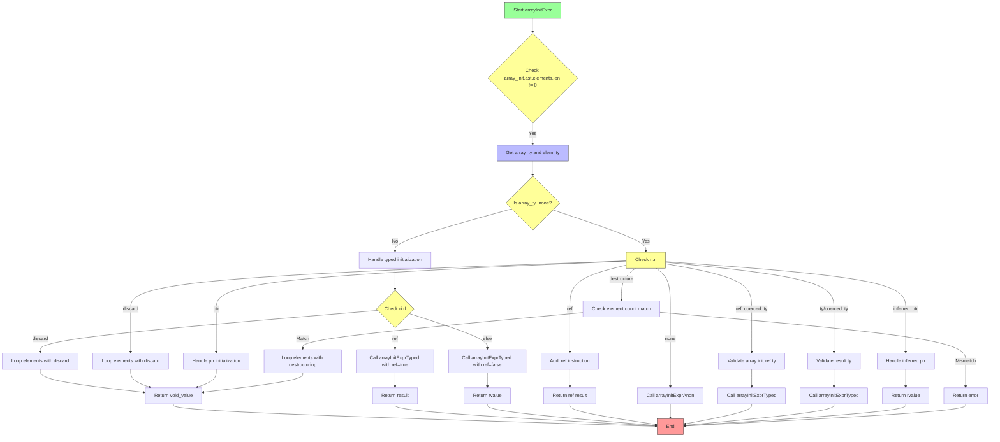

嗯，用户让我用Mermaid画一个Zig函数arrayInitExpr的流程图。首先，我需要理解这个函数的结构和逻辑流程。这个函数处理数组初始化表达式，根据不同的条件生成不同的ZIR指令。看起来函数内部有很多条件分支和不同的处理路径，比如处理类型化的数组初始化、匿名初始化、不同的结果位置（rl）处理等。

首先，我需要通读代码，理解各个部分的逻辑。函数开始检查array_init.ast.elements.len不为零，因为如果是零的话会被当作结构体初始化。然后，它尝试获取数组类型array_ty和元素类型elem_ty。这里有一个inst块，根据是否存在类型表达式来决定如何处理类型推断。如果有类型表达式，可能会处理数组长度、元素类型和哨兵值；如果没有，则进行其他处理。

接下来，根据array_ty是否为.none，函数进入不同的逻辑分支。如果array_ty存在，则处理类型化初始化，根据结果位置（ri.rl）的不同情况，比如discard、ref、其他情况等，分别处理每个元素。如果array_ty不存在，则根据结果位置的不同情况处理匿名初始化、引用、类型强制转换等。

然后，代码中有一个大的switch语句处理不同的rl情况，比如none、discard、ref、ref_coerced_ty、ty、coerced_ty、ptr、inferred_ptr、destructure等，每个情况有不同的处理方式，比如调用不同的子函数或生成不同的指令。

为了画出流程图，我需要将这些条件分支和逻辑流程分步骤表示出来。可能需要从函数入口开始，按照代码的执行顺序，逐步画出每个条件判断和处理分支。注意每个条件判断后的不同路径，以及它们如何连接到后续的处理步骤。例如，当处理类型化的初始化时，根据rl的不同，可能返回void_value、调用arrayInitExprTyped，或者处理rvalue。而在非类型化的情况下，根据rl的不同情况，可能需要处理匿名初始化、添加引用、验证类型，或者处理指针等情况。

另外，还需要注意错误处理和可能的返回点，比如在destructure情况下，如果元素数量不匹配，会返回错误。这也是流程图中的一个分支。

可能需要将整个函数分解为几个主要部分：类型推断部分、类型化初始化处理、非类型化初始化处理，以及根据结果位置的不同处理。每个部分内部又有多个子分支。需要确保每个判断节点和操作步骤在流程图中清晰呈现。

最后，要使用Mermaid的语法正确表示这些流程，包括开始和结束节点，条件判断的菱形框，处理步骤的矩形框，以及各个节点之间的箭头连接。可能需要使用子图来组织复杂的部分，但Mermaid的子图支持有限，可能需要用条件判断和分支来简化结构。

在画图过程中，需要检查是否有遗漏的分支或处理步骤，确保所有可能的执行路径都被覆盖。同时，保持流程图的简洁和可读性，避免过于复杂。可能需要将一些重复的处理步骤合并，或者用注释说明某些复杂逻辑。
================================================

该流程图展示了以下关键路径：
1. 初始类型检查和处理路径选择
2. 带类型初始化的多分支处理（discard/ref/普通情况）
3. 无类型初始化时的多结果位置处理（7种不同rl场景）
4. 解构初始化时的元素数量验证
5. 各路径最终汇聚到结束节点
主要决策点使用黄色菱形表示，处理步骤使用蓝色矩形，开始/结束节点使用绿色/红色表示。