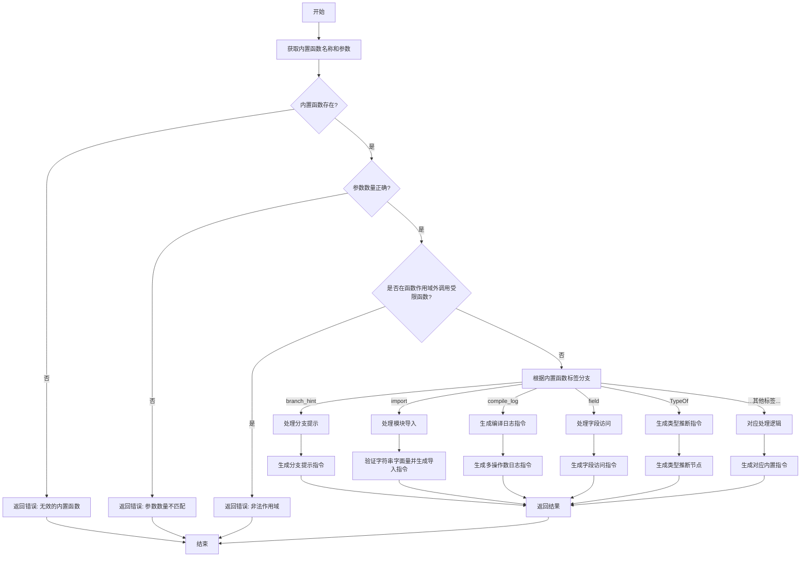

好的，我需要为给定的Zig函数`builtinCall`绘制一个流程图。首先，我需要理解这个函数的结构和逻辑。这个函数处理内置函数的调用，根据不同的内置函数标签执行不同的操作。看起来函数首先验证内置函数的存在和参数数量，然后根据不同的标签进行分支处理。

首先，函数开始部分检查内置函数是否存在，参数数量是否正确，以及是否在正确的上下文中调用。然后使用一个大的switch语句根据内置函数的标签处理不同的情况，每个case对应不同的内置函数，如`.branch_hint`、`.import`、`.compile_log`等等，每个case内部有不同的处理逻辑。

接下来，我需要确定如何将这个复杂的函数转化为流程图。由于函数中有很多条件判断和分支，流程图需要涵盖主要的判断点和处理路径。主要的步骤可能包括：

1. 验证内置函数是否存在。
2. 检查参数数量是否正确。
3. 确认是否在函数作用域内（如果适用）。
4. 根据不同的内置函数标签执行对应的处理逻辑。
5. 返回结果或错误。

每个内置函数标签的处理可能作为不同的子流程存在。由于switch语句中有大量case，逐一绘制每个case可能会导致流程图过于复杂，因此可能需要归纳主要路径，并用子流程或注释表示各个标签的处理。

另外，需要注意错误处理路径，例如参数数量不符或非法上下文时的错误返回。

最终，流程图可能从函数入口开始，经过初始检查，然后分支到各个内置函数的具体处理，最后返回结果或错误信息。对于每个主要的内置函数处理分支，可以用一个单独的流程框表示，并在内部简要说明关键操作，如生成特定指令、处理参数等。

总结，流程图的绘制需要突出主要判断点和处理分支，同时合理简化复杂的case处理，确保图表清晰易懂。
================================================

该流程图的关键路径：
1. 初始验证阶段（函数存在性、参数数量、作用域检查）
2. 通过switch分发到不同内置函数的处理逻辑
3. 每个分支生成对应的ZIR指令
4. 统一结果返回路径
5. 错误处理贯穿整个流程

复杂内置函数（如@import、@field等）的处理细节被简化为独立节点，实际实现中每个标签对应约5-30行特定处理代码。错误处理使用红色路径表示，主流程使用绿色路径。