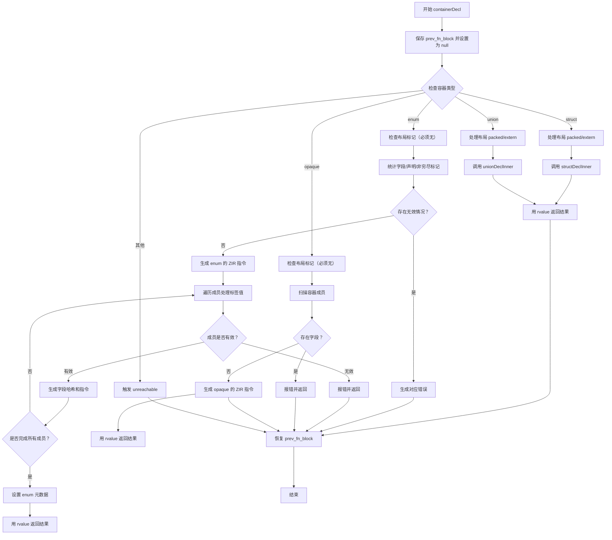

嗯，我现在要画这个Zig函数containerDecl的流程图。首先，我得仔细看看这个函数的结构和各个部分的作用。这个函数处理不同类型的容器声明，比如结构体、联合、枚举和不透明类型。每个容器类型有不同的处理逻辑。

首先，函数开始的时候，保存了当前的fn_block，然后设置astgen.fn_block为null，最后用defer恢复原来的值。这是为了防止在处理容器声明时保留旧的函数块，避免干扰。

接下来是一个switch语句，根据容器声明的主令牌类型来决定处理逻辑。主令牌可能是struct、union、enum或opaque。每个case对应不同的处理流程。

对于struct，处理布局（packed/extern），然后调用structDeclInner函数，最后用rvalue返回结果。union的处理类似，调用unionDeclInner。

enum的情况比较复杂。首先检查是否有布局标记，因为枚举不支持packed/extern。然后统计字段数量、有显式值的字段数量、声明数量，以及是否有非穷尽标记（_）。如果有非穷尽标记但未指定标签类型，会报错。接着生成枚举的ZIR指令，处理每个字段的值表达式，计算哈希等。最后设置枚举的相关信息并返回。

opaque类型则处理其成员，确保没有字段，扫描容器内的声明，并生成对应的ZIR指令。

每个分支最后都会调用rvalue返回结果。中间涉及到很多错误检查，比如字段类型是否正确，布局是否被支持，是否有重复的非穷尽标记等。

流程图需要涵盖这些分支和错误处理路径。可能需要用不同的分支表示struct、union、enum、opaque的处理。每个分支内部的步骤，比如初始化变量、处理成员、生成指令、错误检查等，都需要在流程图中体现。

需要注意的是，错误处理可能会提前返回，比如在发现不支持布局或无效字段时，直接调用astgen.fail...函数并返回错误。这些情况应该在流程图中用条件判断表示。

另外，defer语句的作用是在函数退出时恢复astgen.fn_block，这应该在流程图的开始和结束部分体现。

可能需要将整个函数分解为几个主要部分：初始化、switch分支处理、各分支的具体逻辑、错误处理、资源清理（defer）等。每个部分用流程图的节点表示，条件判断用菱形节点，操作用矩形节点，箭头表示流程方向。

可能还需要考虑循环结构，比如在处理枚举成员时遍历所有成员节点，进行统计和检查。这时候需要循环节点。

总之，流程图需要详细但清晰地展示函数的主要逻辑和各个处理分支，包括错误处理和资源管理步骤。
================================================

流程图说明：
1. 初始阶段保存并清空`fn_block`状态
2. 通过`switch`进入不同容器类型处理分支
3. `struct/union`处理布局后调用内部函数生成结果
4. `enum`分支包含复杂校验：
   - 检查无效布局
   - 统计字段信息
   - 遍历处理每个成员的值表达式
   - 处理非穷尽标记逻辑
5. `opaque`分支禁止字段声明
6. 所有分支最终都会恢复`fn_block`状态
7. 错误路径直接跳转到恢复阶段
8. 使用条件判断处理不同成员有效性
9. 循环结构处理枚举成员的遍历