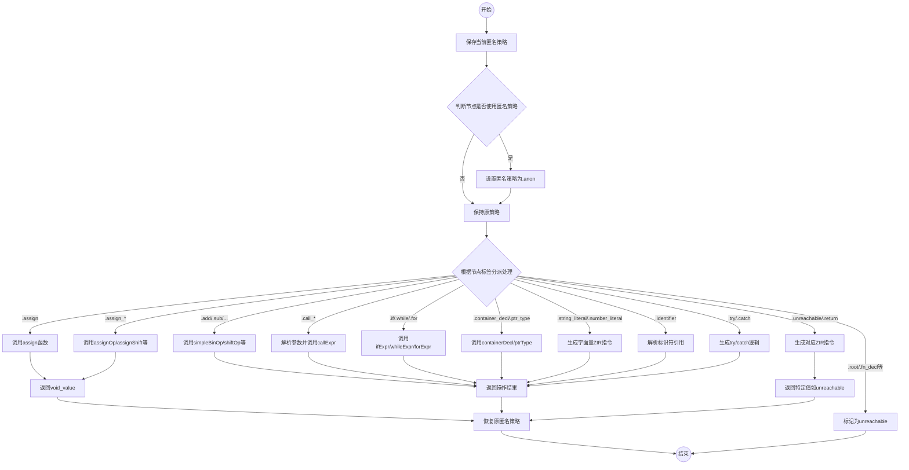

嗯，我需要为提供的Zig函数`expr`绘制一个流程图。首先，我得理解这个函数的结构和逻辑。看起来这个函数处理不同类型的AST节点，根据节点的标签（tag）分派到不同的处理函数。每个case对应不同的语法结构，比如赋值、二元操作、函数调用等。

首先，我应该确定函数的主要流程。函数开始处设置了一些状态，比如保存之前的匿名名称策略，然后根据节点是否使用匿名名称策略来调整当前策略。之后是一个大的switch语句，根据节点的标签进行不同的处理。每个case可能调用其他函数，比如`assign`、`simpleBinOp`、`fieldAccess`等，或者直接返回结果。

接下来，我需要将这个过程转化为流程图。流程图应该从函数入口开始，展示各个分支判断和处理步骤。由于switch语句有很多case，可能需要用多个判断框来表示不同的节点类型，每个判断框对应一个或多个处理步骤。每个处理步骤可能是一个函数调用或直接生成ZIR指令，最后返回结果。

需要注意的是，有些case标记为unreachable，可能是顶层声明，不在表达式处理范围内。这些情况可以单独列出，但不需要详细处理。主要关注那些有实际处理逻辑的case，比如.assign、.add、.call等。

另外，函数中有很多错误处理和资源管理，比如defer语句恢复匿名名称策略。虽然这些在代码中很重要，但在流程图中可能不需要详细体现，主要关注主流程。

可能的流程图结构如下：

1. 开始
2. 保存当前匿名策略
3. 判断是否使用匿名策略，如果是，设置为.anon
4. 根据节点标签进入不同的处理分支
5. 每个分支处理对应的AST节点类型，调用相应函数或生成ZIR指令
6. 处理完成后返回结果
7. 结束前恢复匿名策略

对于每个节点标签的分支，可以用判断框表示，然后连接到对应的处理步骤。例如，对于.assign，调用assign函数，然后返回void_value。对于.add，调用simpleBinOp并返回结果。

由于节点类型非常多，可能需要将这些分支分组或简化，避免流程图过于复杂。例如，将类似的节点类型合并为一个步骤，如所有赋值操作可以归为一类，所有二元操作为另一类。

最后，确保流程图的逻辑清晰，能够反映函数的主要处理流程，而不会陷入过多的细节中。
================================================
